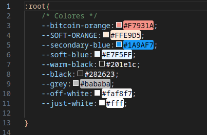

extensión de VS Code para resaltar colores en sus archivos CSS.     ------> https://marketplace.visualstudio.com/items?itemName=naumovs.color-highlight




**Cómo hacer el posicionamiento de contenido**

Como parte de las buenas prácticas tenemos un orden en que es recomendable escribir el código dentro de CSS. Te ayudarán a tener todas las secciones organizadas y saber dónde regresar cuando necesites hacer un cambio o solucionar un problema.

1. Posicionamiento --> static, absolute, relative, fixed.
2. Modelo de caja (Box model) --> margin, border, padding, content.
3. Tipografía --> tipos, tamaños de fuente, etc.
4. Estilos visuales --> box-shadow, border-radius, gradient, etc.
5. Otros --> misceláneos, reglas CSS y más.

**Cómo crear variables**

En la sección de Branding del diseño en Figma podemos ver todos los colores que se usan. Por ahora, las variables que vamos a crear van a ser de estos colores.


Al hacer clic sobre el ícono de ajuste de cada color, se abre la información sobre el mismo. Ahí tenemos el código hexadecimal que necesitamos.


Recordemos que para declarar una variable en CSS debemos usar la función :root y añadir un nombre a la variable que contendrá el valor que vamos a usar repetidas veces en nuestro código. Seleccionando todos los colores, tendríamos:

```css
:root {
--bitcoin-orange: #f7931a;
--soft-orange: #ffe9d5;
--secondary-blue: #1a9af7;
--soft-blue: #e7f5ff;
--warm-black: #282623;
--black: #201e1c;
--grey: #bababa;
--off-white: #faf8f7;
--just-white: #fff;
}
```

Cómo hacer el reinicio de estilos
Una vez declarada la sección de variables que va hasta arriba, es hora de reiniciar los estilos que el navegador trae por defecto con las prácticas que ya conocemos.

```css
* {
    box-sizing: border-box;
    margin: 0;
    padding: 0;
}
```

También cambiaremos el tamaño de fuente a 62.5% para que sea sencillo de usar con las medidas REM. Y cambiaremos el estilo de fuente que hemos embebido desde Google Fonts.

```css
html {
    font-size: 62.5;
    font-family: 'DM Sans', sans-serif;
}
```

Acabas de aplicar los primeros estilos al reiniciar los que vienen por defecto, aplicar el estilo de fuente y crear las primeras variables del proyecto. ¡Avanzamos rápido y seguro!

