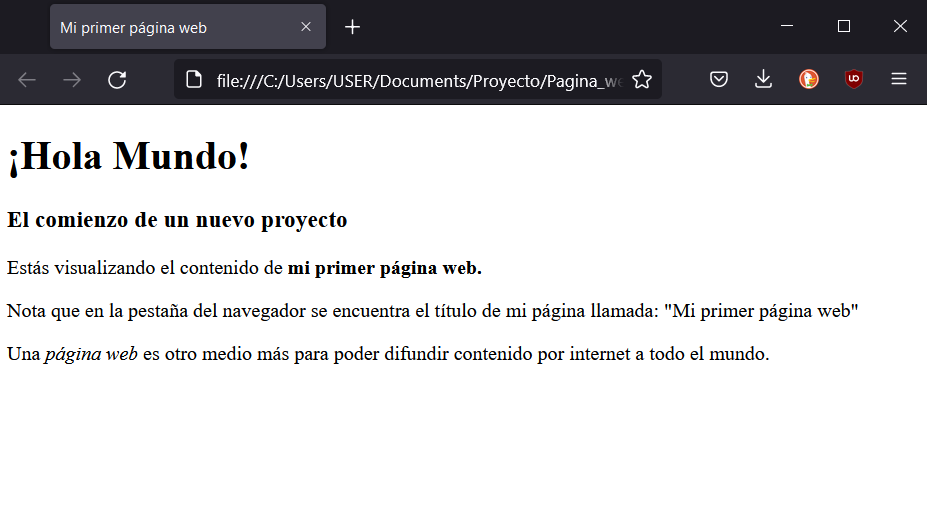
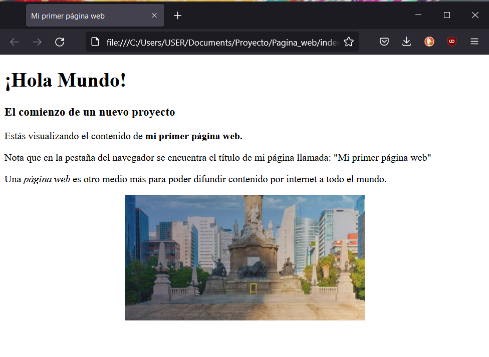

# Crear tu Primera Página Web con HTML 
A continuación, te enseñaré cómo crear una página web sencilla utilizando HTML, y cómo agregar una imagen a tu página. Usaremos Visual Studio Code (VS Code) o Sublime Text como editores de texto.

## Paso 1: Preparativos Iniciales

1. **Crear una Carpeta Nueva:**
   - Crea una carpeta en tu sistema operativo y nómbrala `Pagina_web`. Esta carpeta almacenará todos los archivos relacionados con tu proyecto.

   

2. **Abrir el Editor de Texto:**
   - Abre Visual Studio Code o Sublime Text.

   

## Paso 2: Crear y Guardar el Archivo HTML

1. **Crear un Nuevo Archivo:**
   - En VS Code: Ve a `File > New File`.
   - En Sublime Text: Ve a `File > New File`.

2. **Escribir el Código HTML:**
   - Copia y pega el siguiente código en tu nuevo archivo:

    ```html
    <!DOCTYPE html>
    <html>
    <head>
        <title>Mi primera página web</title>
    </head>
    <body>
        <h1>¡Hola Mundo!</h1>
        <h3>El comienzo de un nuevo proyecto</h3>
        <p>Estás visualizando el contenido de <strong>mi primera página web.</strong></p>
        <p>Nota que en la pestaña del navegador se encuentra el título de mi página llamada:
        "Mi primera página web"</p>
        <p>Una <i>página web</i> es otro medio más para poder difundir contenido por
        internet a todo el mundo.</p>
    </body>
    </html>
    ```


3. **Guardar el Archivo:**
   - Guarda el archivo como `index.html` en la carpeta `Pagina_web`.

## Paso 3: Visualizar la Página Web

1. **Abrir el Archivo en el Navegador:**
   - Navega hasta la carpeta `Pagina_web` y abre `index.html` con tu navegador web preferido.
   - Deberías ver una página con el contenido definido en el archivo HTML.



## Paso 4: Agregar una Imagen a la Página Web

1. **Preparar la Imagen:**
   - Descarga o ubica una imagen en tu computadora que desees agregar a tu página web.
   - Crea una carpeta llamada `imagenes` dentro de la carpeta `Pagina_web`.
   - Descarga una imagen de internet, Copia la imagen a la carpeta `imagenes` y nómbrala `ciudad.PNG` (puede ser cualquier nombre, pero asegúrate de usar la misma en el código).

2. **Modificar el Archivo HTML:**
   - Abre el archivo `index.html` y reemplaza su contenido con el siguiente código:

    ```html
    <!DOCTYPE html>
    <html>
    <head>
        <title>Mi primera página web</title>
        <style>
            img {
                display: block;
                margin: auto;
                width: 50%;
            }
        </style>
    </head>
    <body>
        <h1>¡Hola Mundo!</h1>
        <h3>El comienzo de un nuevo proyecto</h3>
        <p>Estás visualizando el contenido de <strong>mi primera página web.</strong></p>
        <p>Nota que en la pestaña del navegador se encuentra el título de mi página llamada:
        "Mi primera página web"</p>
        <p>Una <i>página web</i> es otro medio más para poder difundir contenido por
        internet a todo el mundo.</p>
        
    </body>
    </html>
    ```

3. **Guardar los Cambios:**
   - Guarda el archivo `index.html`.

4. **Visualizar los Cambios:**
   - Abre nuevamente el archivo `index.html` en tu navegador web. Ahora deberías ver la imagen centrada y con un ancho del 50% del contenedor.

   

## Explicación del Código

- `<!DOCTYPE html>`: Indica que el documento es HTML5.
- `<html>`: Contiene todo el contenido de la página web.
- `<head>`: Contiene meta información sobre el documento, como su título y estilos.
- `<title>`: Define el título de la página que aparece en la pestaña del navegador.
- `<style>`: Define los estilos CSS directamente dentro del archivo HTML.
- `<body>`: Contiene el contenido principal que se muestra en la página.
- `<h1>` y `<h3>`: Encabezados de diferentes niveles.
- `<p>`: Define párrafos de texto.
- `<strong>`: Resalta el texto en negrita.
- `<i>`: Aplica estilo de cursiva al texto.
- ``: Inserta una imagen en la página, con atributos `src` (fuente de la imagen) y estilos CSS para centrarla y ajustar su tamaño.

## Resultado Final

¡Felicidades! Has creado y personalizado tu primera página web con HTML, incluyendo texto e imágenes. Continúa explorando HTML y CSS para aprender más sobre cómo crear páginas web más complejas y atractivas.