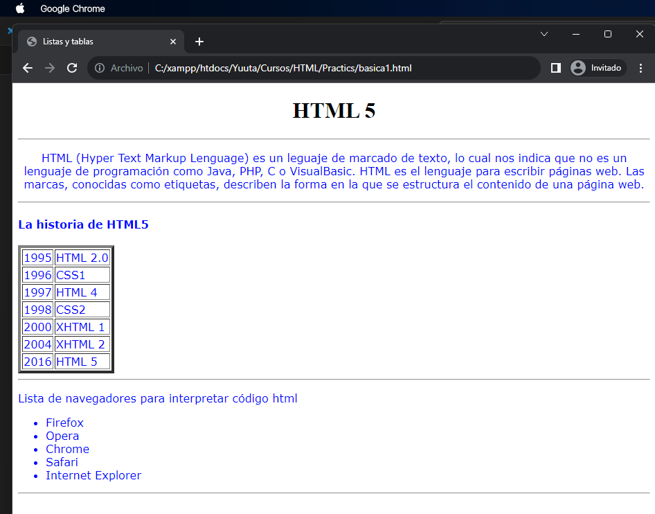

**Paso 1: Crear un nuevo archivo HTML**
- Abre un editor de texto (como Notepad, Visual Studio Code o cualquier otro de tu elección).
- Crea un nuevo archivo y guárdalo con la extensión ".html", por ejemplo, "pagina.html".

**Paso 2: Definir la estructura básica**
```html
<!DOCTYPE html>
<html lang="en">
<head>
    <meta charset="UTF-8">
    <meta name="viewport" content="width=device-width, initial-scale=1.0">
    <title>Listas y tablas</title>
</head>
<body>
</body>
</html>
```
- La etiqueta `<!DOCTYPE html>` define la versión de HTML que estamos utilizando (HTML5).
- La etiqueta `<html lang="en">` establece el idioma de la página como inglés.
- El elemento `<head>` contiene metadatos sobre la página, como el juego de caracteres y el título de la página.
- Las etiquetas `<meta>` especifican el juego de caracteres (UTF-8) y la configuración de la vista para dispositivos móviles.
- El elemento `<title>` define el título de la página que aparecerá en la pestaña del navegador.


**Paso 3: Agregar el contenido principal**
- `<body>` inicia la sección principal del contenido de la página.

```html
    <h1><center><font face"Arial" color="black">HTML 5</font></center></h1>
```
- `<h1>` crea un encabezado de nivel 1 con el texto "HTML 5". `<center>` se utiliza para centrar el contenido, aunque es una etiqueta obsoleta. `<font>` se utiliza para establecer la fuente y el color del texto, aunque se recomienda usar CSS para esto.

Asi va quedando de momento:
```html
<!DOCTYPE html>
<html lang="en">
<head>
    <meta charset="UTF-8">
    <meta name="viewport" content="width=device-width, initial-scale=1.0">
    <title>Listas y tablas</title>
</head>
<body>
        <h1><center><font face"Arial" color="black">HTML 5</font></center></h1>
</body>
</html>
```

- `<hr>` crea una línea horizontal como separador en la página.

```html
    <font color="#0008FF" face="verdana">
```
- `<font>` se utiliza para configurar la fuente y el color del texto.

```html
        <p align="center">
```

- `<p>` define un párrafo de texto y `align="center"` lo centra en la página.

```html
 <hr>
    <font color="#0008FF" face="verdana">
        <p align="center">
            HTML (Hyper Text Markup Lenguage) es un leguaje de marcado de texto, lo cual nos indica que no es un lenguaje de programación como Java, PHP, C o VisualBasic. HTML es el lenguaje para escribir páginas web. Las marcas, conocidas como etiquetas, describen la forma en la que se estructura el contenido de una página web.
         </p>   
```


- `<hr>` se utiliza nuevamente para crear una línea horizontal como separador.

```html
            <h4>La historia de HTML5</h4>
```
- `<h4>` crea un encabezado de tipo 4 con el texto "La historia de HTML5".

```html
<body>
    <h1><center><font face"Arial" color="black">HTML 5</font></center></h1>
    <hr>
    <font color="#0008FF" face="verdana">
        <p align="center">
            HTML (Hyper Text Markup Lenguage) es un leguaje de marcado de texto, lo cual nos indica que no es un lenguaje de programación como Java, PHP, C o VisualBasic. HTML es el lenguaje para escribir páginas web. Las marcas, conocidas como etiquetas, describen la forma en la que se estructura el contenido de una página web.
            <hr>
            <h4>La historia de HTML5</h4> <!--Encabezado de tipo 4  -->
        </p>
    </font>
    
</body>   
```
Continuando añadimos la tabla con la etiqueta ``<table></table>``
```html
            <table border="4">
```
- `<table>` inicia una tabla con bordes (`border="4"`).

```html
                <tr><td>1995</td><td>HTML 2.0</td></tr>
                <tr><td>1996</td><td>CSS1</td></tr>
                <tr><td>1997</td><td>HTML 4</td></tr>
                <tr><td>1998</td><td>CSS2</td></tr>
                <tr><td>2000</td><td>XHTML 1</td></tr>
                <tr><td>2004</td><td>XHTML 2</td></tr>
                <tr><td>2016</td><td>HTML 5</td></tr>
```
- `<tr>` representa filas en la tabla, y `<td>` define las celdas dentro de las filas.

```html
            <body>
    <h1><center><font face"Arial" color="black">HTML 5</font></center></h1>
    <hr>
    <font color="#0008FF" face="verdana">
        <p align="center">
            HTML (Hyper Text Markup Lenguage) es un leguaje de marcado de texto, lo cual nos indica que no es un lenguaje de programación como Java, PHP, C o VisualBasic. HTML es el lenguaje para escribir páginas web. Las marcas, conocidas como etiquetas, describen la forma en la que se estructura el contenido de una página web.
            <hr>
            <h4>La historia de HTML5</h4> <!--Encabezado de tipo 4  -->
            <table border="4">
                <tr><td>1995</td><td>HTML 2.0</td></tr>
                <tr><td>1996</td><td>CSS1</td></tr>
                <tr><td>1997</td><td>HTML 4</td></tr>
                <tr><td>1998</td><td>CSS2</td></tr>
                <tr><td>2000</td><td>XHTML 1</td></tr>
                <tr><td>2004</td><td>XHTML 2</td></tr>
                <tr><td>2016</td><td>HTML 5</td></tr>
            </table>
            </p>
    </font>
    
</body>
```

- `<hr>` crea otra línea horizontal como separador.

```html
            <p>Lista de navegadores para interpretar código HTML</p>
```
- `<p>` define un párrafo con el texto "Lista de navegadores para interpretar código HTML".

```html
            <ul>
                <li>Firefox</li>
                <li>Opera</li>
                <li>Chrome</li>
                <li>Safari</li>
                <li>Internet Explorer</li>
            </ul>
```
- `<ul>` inicia una lista desordenada y `<li>` define los elementos de la lista.

```html
            <body>
    <h1><center><font face"Arial" color="black">HTML 5</font></center></h1>
    <hr>
    <font color="#0008FF" face="verdana">
        <p align="center">
            HTML (Hyper Text Markup Lenguage) es un leguaje de marcado de texto, lo cual nos indica que no es un lenguaje de programación como Java, PHP, C o VisualBasic. HTML es el lenguaje para escribir páginas web. Las marcas, conocidas como etiquetas, describen la forma en la que se estructura el contenido de una página web.
            <hr>
            <h4>La historia de HTML5</h4> <!--Encabezado de tipo 4  -->
            <table border="4">
                <tr><td>1995</td><td>HTML 2.0</td></tr>
                <tr><td>1996</td><td>CSS1</td></tr>
                <tr><td>1997</td><td>HTML 4</td></tr>
                <tr><td>1998</td><td>CSS2</td></tr>
                <tr><td>2000</td><td>XHTML 1</td></tr>
                <tr><td>2004</td><td>XHTML 2</td></tr>
                <tr><td>2016</td><td>HTML 5</td></tr>
            </table>
            <hr>
            <p>Lista de navegadores para interpretar código html</p>
            <ul>
                <li>Firefox</li>
                <li>Opera</li>
                <li>Chrome</li>
                <li>Safari</li>
                <li>Internet Explorer</li>
            </ul>
            <hr>
        </p>
    </font>
    
</body>
```
- `<hr>` crea otra línea horizontal como separador.

```html
        </p>
    </font>
</body>
```
- Cierra el párrafo `<p>`, el elemento `<font>`, y el elemento `<body>`.

**Paso 4: Guardar y visualizar**
- Guarda el archivo HTML.
- Abre el archivo en un navegador web para ver la página que has creado.

Tiene que verse de la siguiente manera

