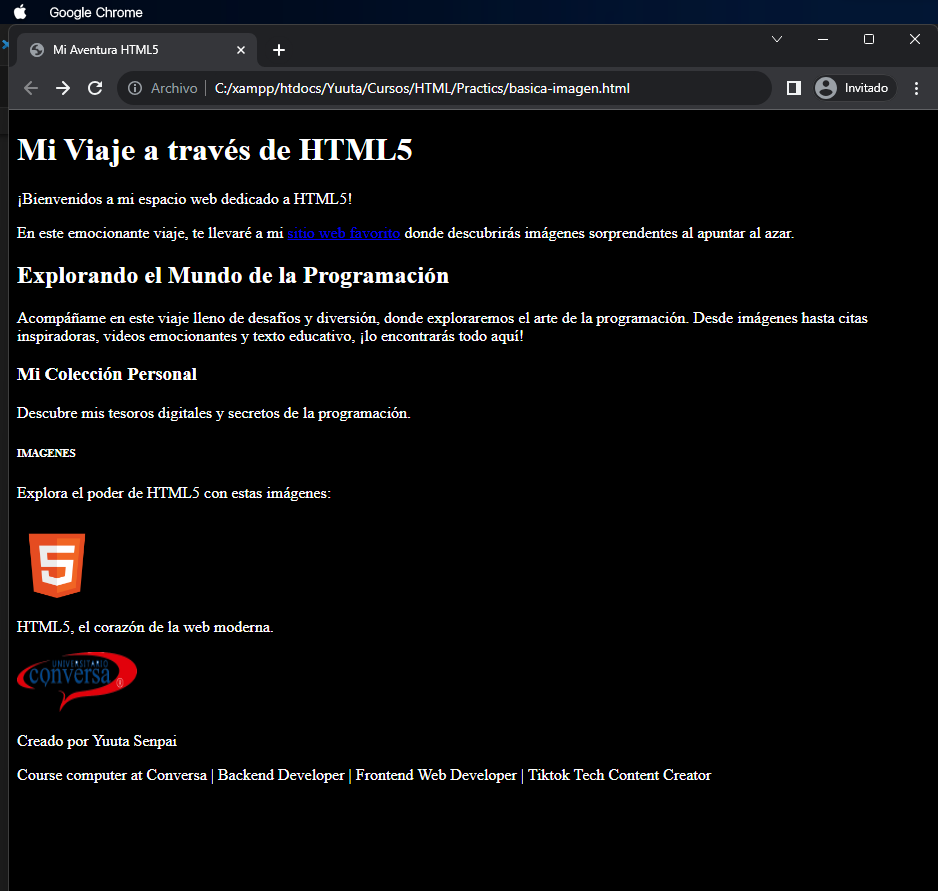

**Paso 1: Crear un Nuevo Viaje en HTML5**


- En este viaje, comenzamos con las etiquetas básicas. `<meta charset="UTF-8">` establece el juego de caracteres para admitir texto multilingüe, y `<meta name="viewport" content="width=device-width, initial-scale=1.0">` prepara nuestra aventura para dispositivos móviles.

```html
<!DOCTYPE html>
<html lang="en">
<head>
    <meta charset="UTF-8">
    <meta name="viewport" content="width=device-width, initial-scale=1.0">
    <title>Mi Aventura HTML5</title>
</head>
<body bgcolor="black" text="white">
```


---

**Paso 2: Nuestro Encabezado y Bienvenida**

- La etiqueta `<header>` marca el comienzo de nuestra historia. Un `<h1>` nos da la bienvenida y un párrafo (`<p>`) nos presenta a nuestra audiencia.

```html
    <header>
        <h1>Mi Viaje a través de HTML5</h1>
        <p>¡Bienvenidos a mi espacio web dedicado a HTML5!</p>
    </header>
```


---

**Paso 3: Comenzamos la Exploración**

- Entramos en la sección principal de nuestro viaje. Un artículo (`<article>`) presenta nuestro primer destino, un sitio web favorito con imágenes sorprendentes. También destacamos la exploración del mundo de la programación, con textos informativos y atractivos.

```html
    <section>
        <article>
            <p>En este emocionante viaje, te llevaré a mi <a href="https://pointerpointer.com/">sitio web favorito</a> donde descubrirás imágenes sorprendentes al apuntar al azar.</p>
            <h2>Explorando el Mundo de la Programación</h2>
            <p>Acompáñame en este viaje lleno de desafíos y diversión, donde exploraremos el arte de la programación. Desde imágenes hasta citas inspiradoras, videos emocionantes y texto educativo, ¡lo encontrarás todo aquí!</p>
        </article>   
    </section>
```


---

**Paso 4: Descubre Mi Colección**

- En la sección de "Mi Colección Personal," compartimos tesoros y secretos de la programación en un área lateral (`<aside>`). Un título de nivel 3 (`<h3>`) introduce este contenido.

```html
    <aside>
        <h3>Mi Colección Personal</h3>
        <p>Descubre mis tesoros digitales y secretos de la programación.</p>
    </aside>
```


---

**Paso 5: Imágenes y Créditos**

- Nuestro viaje llega a su conclusión en el `<footer>`, donde mostramos dos imágenes que representan el poder de HTML5. También proporcionamos créditos y detalles sobre el autor de este emocionante viaje.

```html
    <footer>
        <h6>IMAGENES</h6>
        <p>Explora el poder de HTML5 con estas imágenes:</p>
        
        <p>HTML5, el corazón de la web moderna.</p>
        
        <p>Creado por Yuuta Senpai</p>
        <p>Course computer at Conversa | Backend Developer | Frontend Web Developer | Tiktok Tech Content Creator</p>
    </footer>
</body>
</html>
```


---

**Paso 6: Guarda y Explora**

- Ahora que hemos creado nuestra aventura en HTML5, guárdala como un archivo HTML y ábrela en tu navegador para explorarla por ti mismo.

¡Espero que hayas disfrutado de este viaje imaginario a través del lenguaje HTML5! Cada etiqueta desempeña un papel vital en la construcción de esta experiencia web.

El resultado tendría que ser algo como esto

