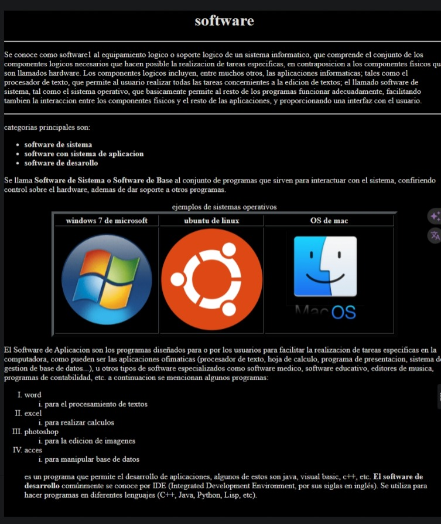

### Práctica de HTML paso a paso

Vamos a analizar y comprender el código HTML presentado bloque a bloque. Este documento HTML muestra información sobre software, sus tipos y algunos ejemplos. A continuación, se explica cada sección del código:



#### 1. Declaración del documento y configuración básica

```html
<!DOCTYPE html>
<html lang="es">
<head>
    <meta charset="UTF-8">
    <meta name="viewport" content="width=device-width, initial-scale=1.0">
    <title>Software</title>
</head>
```

**Explicación:**
- `<!DOCTYPE html>`: Declara el tipo de documento como HTML5.
- `<html lang="es">`: Comienza el documento HTML y especifica que el idioma es español.
- `<head>`: Contiene metadatos sobre el documento.
  - `<meta charset="UTF-8">`: Establece la codificación de caracteres como UTF-8.
  - `<meta name="viewport" content="width=device-width, initial-scale=1.0">`: Configura la vista para que sea adaptable a diferentes tamaños de pantalla.
  - `<title>Software</title>`: Define el título de la página que aparece en la pestaña del navegador.

#### 2. Configuración del cuerpo del documento

```html
<body bgcolor="black" link="white" vlink="yellow">
```

**Explicación:**
- `<body bgcolor="black" link="white" vlink="yellow">`: Inicia el cuerpo del documento y establece:
  - `bgcolor="black"`: Fondo del cuerpo en negro.
  - `link="white"`: Color de los enlaces en blanco.
  - `vlink="yellow"`: Color de los enlaces visitados en amarillo.

#### 3. Contenido principal del cuerpo

```html
<font color="white">
    <h1 align="center">software</h1>
    <hr>
    <p>Se conoce como software...</p>
    <hr>
    <p>categorias principales son:</p>
    <ul>
        <li><b> software de sistema</b></li>
        <li><b>software con sistema de aplicacion </b></li>
        <li><b> software de desarollo</b></li>
    </ul>
    <p>Se llama <b>Software de Sistema...</b></p>
    <table border="5" align="center">
        <caption>ejemplos de sistemas operativos</caption>
        <tr>
            <th>windows 7 de microsoft</th>
            <th>ubuntu de linux </th>
            <th>OS de mac</th>
        </tr>
        <tr>
            <td></td>
            <td></td>
            <td></td>
        </tr>
    </table>
    <p>El Software de Aplicacion...</p>
    <ol type="I">
        <li>word
            <ol type="i">
                <li>para el procesamiento de textos</li>
            </ol>
        </li>
        <li>excel
            <ol type="i">
                <li>para realizar calculos</li>
            </ol>
        </li>
        <li>photoshop
            <ol type="i">
                <li>para la edicion de imagenes</li>
            </ol>
        </li>
        <li>acces
            <ol type="i">
                <li>para manipular base de datos</li>
            </ol>
        </li>
    </ol>
    <p>es un programa que permite el desarrollo...</p>
    <b>El software de desarrollo...</b>
</font>
<br>
```

**Explicación:**
- `<font color="white">`: Cambia el color del texto a blanco (aunque está obsoleto, se recomienda usar CSS para esto).
- `<h1 align="center">software</h1>`: Encabezado de nivel 1 centrado con el texto "software".
- `<hr>`: Línea horizontal.
- `<p>`: Párrafo de texto explicativo sobre el software.
- `<ul>`: Lista desordenada con categorías de software.
- `<li><b>...</b></li>`: Elementos de lista con texto en negrita.
- `<table border="5" align="center">`: Tabla con borde de 5 píxeles y centrada.
  - `<caption>`: Título de la tabla "ejemplos de sistemas operativos".
  - `<tr>`: Fila de la tabla.
    - `<th>`: Encabezados de columna.
    - `<td>`: Celdas de la tabla con imágenes.
- `<ol type="I">`: Lista ordenada con números romanos.
  - `<li>`: Elementos de lista con sub-listas (`<ol type="i">`).
- `<br>`: Salto de línea.

#### 4. Cierre del documento

```html
</body>
</html>
```

**Explicación:**
- `</body>`: Finaliza el cuerpo del documento.
- `</html>`: Finaliza el documento HTML.

