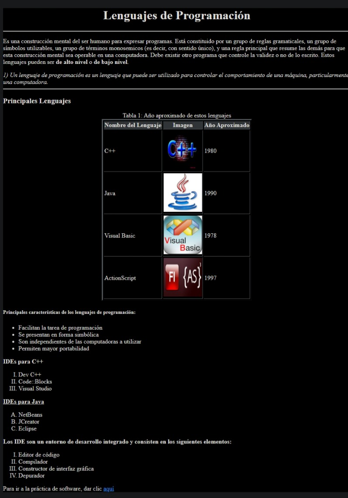

# Lenguajes de Programación



## Paso 1: La Estructura Básica

Primero, necesitamos el esqueleto básico de un documento HTML. Esto es lo que verás en el código:

```html
<!doctype html>
<html lang="es">
<head>
    <meta charset="utf-8">
    <title>Lenguajes de Programación</title>
</head>
```

- `<!doctype html>`: Esta línea declara que estamos utilizando HTML5.
- `<html lang="es">`: Define el idioma del documento como español.
- `<head>`: Contiene metadatos y enlaces a recursos externos.
- `<meta charset="utf-8">`: Especifica la codificación de caracteres como UTF-8.
- `<title>Lenguajes de Programación</title>`: Define el título de la página que aparece en la pestaña del navegador.

## Paso 2: El Cuerpo del Documento

El contenido visible de la página web se coloca dentro del `<body>`. Aquí es donde añadimos todos los elementos que los usuarios verán.

### Configuración del Fondo y Color del Texto

```html
<body bgcolor="black">
    <font color="white">
```

- `bgcolor="black"`: Establece el color de fondo de la página a negro.
- `<font color="white">`: Cambia el color del texto a blanco.

### Encabezado Principal

```html
    <h1 align="center">Lenguajes de Programación</h1>
```

- `<h1 align="center">`: Crea un encabezado de nivel 1 alineado al centro.

### Línea Horizontal

```html
    <hr>
```

- `<hr>`: Inserta una línea horizontal para separar secciones de contenido.

### Párrafo de Introducción

```html
    <p>
        Es una construcción mental del ser humano para expresar programas. Está constituido por un grupo de reglas gramaticales, 
        un grupo de símbolos utilizables, un grupo de términos monosemicos (es decir, con sentido único), y una regla principal 
        que resume las demás para que esta construcción mental sea operable en una computadora. Debe existir otro programa que 
        controle la validez o no de lo escrito. Estos lenguajes pueden ser <b>de alto nivel</b> o <b>de bajo nivel</b>.
    </p>
```

- `<p>`: Define un párrafo.
- `<b>`: Hace que el texto esté en negrita.

### Cita

```html
    <cite>
        1) Un lenguaje de programación es un lenguaje que puede ser utilizado para controlar el comportamiento de una máquina, 
        particularmente una computadora.
    </cite>
```

- `<cite>`: Define una cita.

### Subtítulo

```html
    <h3>Principales Lenguajes</h3>
```

- `<h3>`: Crea un encabezado de nivel 3.

### Tabla de Lenguajes de Programación

```html
    <table border="3" align="center">
        <caption>Tabla 1: Año aproximado de estos lenguajes</caption>
        <tr>
            <th bgcolor="#444">Nombre del Lenguaje</th>
            <th bgcolor="#444">Imagen</th>
            <th bgcolor="#444">Año Aproximado</th>
        </tr>
        <tr>
            <td>C++</td>
            <td><a href="http://c.conclase.net/"></a></td>
            <td>1980</td>
        </tr>
        <tr>
            <td>Java</td>
            <td><a href="http://www.java.com/es/"></a></td>
            <td>1990</td>
        </tr>
        <tr>
            <td>Visual Basic</td>
            <td><a href="http://www.canalvirtualbasic.net"></a></td>
            <td>1978</td>
        </tr>
        <tr>
            <td>ActionScript</td>
            <td><a href="http://www.programacion.com/articulo/introduccion_a_actionscript_103"></a></td>
            <td>1997</td>
        </tr>
    </table>
```

- `<table border="3" align="center">`: Crea una tabla con borde de 3 píxeles y alineada al centro.
- `<caption>`: Añade un título a la tabla.
- `<tr>`: Define una fila de la tabla.
- `<th>`: Define una celda de encabezado en la tabla.
- `<td>`: Define una celda estándar en la tabla.
- ``: Inserta una imagen con dimensiones específicas.
- `<a href="http://c.conclase.net/">`: Crea un enlace alrededor de la imagen.

### Lista Desordenada

```html
    <h5>Principales características de los lenguajes de programación:</h5>
    <ul>
        <li>Facilitan la tarea de programación</li>
        <li>Se presentan en forma simbólica</li>
        <li>Son independientes de las computadoras a utilizar</li>
        <li>Permiten mayor portabilidad</li>
    </ul>
```

- `<h5>`: Crea un encabezado de nivel 5.
- `<ul>`: Inicia una lista desordenada.
- `<li>`: Define un elemento de la lista.

### Lista Ordenada

```html
    <b>IDEs para C++</b>
    <ol type="I">
        <li>Dev C++</li>
        <li>Code::Blocks</li>
        <li>Visual Studio</li>
    </ol>
    <b><u>IDEs para Java</u></b>
    <ol type="A">
        <li>NetBeans</li>
        <li>JCreator</li>
        <li>Eclipse</li>
    </ol>
    <b>Los IDE son un entorno de desarrollo integrado y consisten en los siguientes elementos:</b>
    <ol type="I">
        <li>Editor de código</li>
        <li>Compilador</li>
        <li>Constructor de interfaz gráfica</li>
        <li>Depurador</li>
    </ol>
```

- `<b>`: Hace el texto en negrita.
- `<u>`: Sube la palabra subrayada.
- `<ol type="I">`: Inicia una lista ordenada con números romanos.
- `<ol type="A">`: Inicia una lista ordenada con letras mayúsculas.

### Enlace a una Práctica de Software

```html
    <p>Para ir a la práctica de software, dar clic <a href="#">aquí</a></p>
</font>
</body>
</html>
```

- `<p>`: Define un párrafo.
- `<a href="#">`: Crea un enlace, en este caso, el destino es un lugar en blanco (`#`), que debería ser reemplazado con una URL real.

## ¡Y eso es todo!

Hemos creado una página web informativa sobre lenguajes de programación. Ahora entiendes cómo cada línea de código contribuye a la estructura y apariencia de la página. ¡Espero que hayas disfrutado aprendiendo sobre HTML! Si tienes alguna pregunta, ¡no dudes en preguntar!

¡Hasta la próxima! 🚀