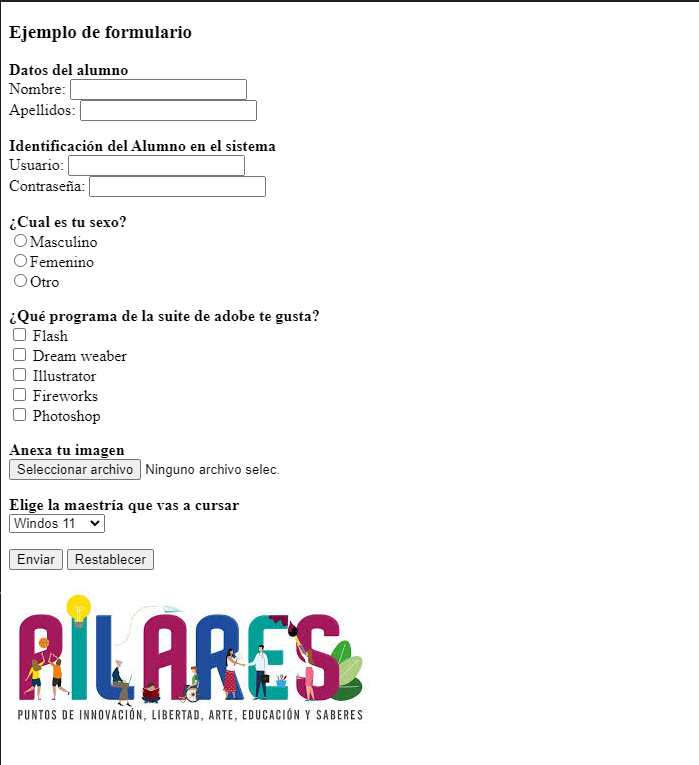

# Formulario con imagen



### Preparando el Terreno


Comencemos creando el esqueleto básico de nuestro formulario. Abre tu editor de código favorito y crea un nuevo archivo HTML. Copia y pega el siguiente código:

```html
<!DOCTYPE html>
<html lang="es">
<head>
    <meta charset="UTF-8">
    <meta name="viewport" content="width=device-width, initial-scale=1.0">
    <title>Formulario Simple con Imagen</title>
</head>
<body>
    <!-- Aquí va nuestro formulario -->
</body>
</html>
```

- `<!DOCTYPE html>`: Esta línea declara que estamos utilizando HTML5.
- `<html lang="es">`: Establece el idioma del documento como español.
- `<head>`: Aquí colocamos metadatos y enlaces a recursos externos.
- `<meta charset="UTF-8">`: Especifica la codificación de caracteres como UTF-8.
- `<meta name="viewport" content="width=device-width, initial-scale=1.0">`: Ajusta la escala para dispositivos móviles.
- `<title>Formulario Simple con Imagen</title>`: Define el título de la página.

### Paso 2: Añadiendo Elementos al Formulario

Ahora que tenemos la estructura básica, vamos a añadir elementos al formulario. Copia y pega este código dentro del cuerpo del documento:

```html
<h3>Ejemplo de formulario</h3>
<form>
    <!-- Contenido del formulario -->
</form>
```

- `<h3>Ejemplo de formulario</h3>`: Un título para nuestro formulario.
- `<form>`: Indica el inicio del formulario.

### Paso 3: Más Detalles, Más Diversión

Vamos a llenar nuestro formulario con campos para que los usuarios puedan introducir su información:

```html
<p>
    <div>
        <b>Datos del alumno</b>
    </div>
    Nombre: <input type="text" name="nombre"><br>
    Apellidos: <input type="text" name="apellidos">
</p>
```

- `<p>`: Define un párrafo, que agrupa los elementos del formulario.
- `<div>`: Crea un contenedor visual para el grupo de campos.
- `<b>`: Hace que el texto esté en negrita.
- `<input type="text" name="nombre">`: Crea un campo de texto para el nombre del alumno.
- `<input type="text" name="apellidos">`: Crea un campo de texto para los apellidos.

### Paso 4: ¡Más Campos, Más Diversión!

Sigamos añadiendo más campos interesantes:

```html
<p>
    <div>
        <b>Identificación del Alumno en el sistema</b>
    </div>
Usuario: <input type="text" name="usuario">
<br>
Contraseña: <input type="text" name="contrasena">
</p>
<p>
    <div>
        <b>¿Cual es tu sexo?</b>
    </div>
<input type="radio" name="sexo" value="masc">Masculino
<br>
<input type="radio" name="sexo" value="fem">Femenino
<br>
<input type="radio" name="otro" value="otro">Otro    
</p>
<p>
    <div>
        <b>¿Qué programa de la suite de adobe te gusta?</b>
    </div>
    <input type="checkbox" name="programas" value="Flash"> Flash <br>
    <input type="checkbox" name="programas" value="Dream"> Dream weaber <br>
    <input type="checkbox" name="programas" value="Illus"> Illustrator <br>
    <input type="checkbox" name="programas" value="Fire"> Fireworks <br>
    <input type="checkbox" name="programas" value="Photo"> Photoshop 
</p>
<p>
    <div>
        <b>Anexa tu imagen</b>
    </div>
    <input type="file" name="Archivo" value="archivo">
</p>
<p>
    <div>
        <b>Elige la maestría que vas a cursar</b>
    </div>
    <select name="MateriaCursar" id="">
        <option value="win11">Windos 11</option>
        <option value="pub">Publisher</option>
        <option value="word">Word</option>
        <option value="pp">Power Point</option>
        <option value="excel">Excel</option>
    </select>
</p>
```

Agrega más campos como usuario, contraseña, opciones de género, programas favoritos y más. Cada uno de estos elementos permitirá a los usuarios proporcionar información específica.

### Paso 5: Acciones del Formulario

Finalmente, agreguemos botones para enviar y restablecer el formulario:

```html
<p>
    <div>
        <input type="submit" value="Enviar">
        <input type="reset" value="Restablecer">
    </div>
    <br>
    <input type="image" src="/src/samples/LogoPilares.jpg" alt="LogoPilares">
</p>
```

- `<input type="submit" value="Enviar">`: Un botón para enviar el formulario.
- `<input type="reset" value="Restablecer">`: Un botón para restablecer los valores del formulario.
- `<input type="image" src="/src/samples/LogoPilares.jpg" alt="LogoPilares">`: Una imagen que actúa como botón de envío.

¡Y eso es todo! Hemos creado un formulario interactivo desde cero. Espero que esta explicación detallada te haya ayudado a comprender cómo funcionan los formularios web. ¡Hasta la próxima! 🚀
