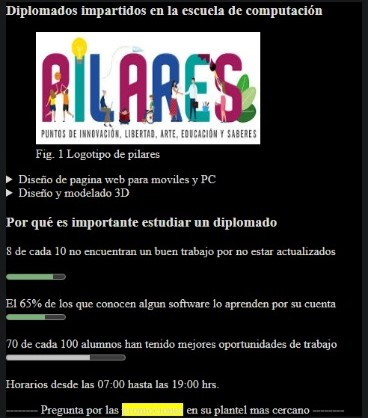

# HTML Informativo



## Paso 1: Estructura Básica del Documento

Primero, necesitamos el esqueleto básico de un documento HTML. Esto es lo que verás en el código:

```html
<!DOCTYPE html>
<html lang="es">
<head>
    <meta charset="UTF-8">
    <meta name="viewport" content="width=device-width, initial-scale=1.0">
    <title>Formulario HTML</title>
</head>
```

- `<!DOCTYPE html>`: Declara que estamos utilizando HTML5.
- `<html lang="es">`: Define el idioma del documento como español.
- `<head>`: Contiene metadatos y enlaces a recursos externos.
- `<meta charset="UTF-8">`: Especifica la codificación de caracteres como UTF-8.
- `<meta name="viewport" content="width=device-width, initial-scale=1.0">`: Ajusta la escala para dispositivos móviles.
- `<title>Formulario HTML</title>`: Define el título de la página que aparece en la pestaña del navegador.

## Paso 2: El Cuerpo del Documento

El contenido visible de la página web se coloca dentro del `<body>`. Aquí es donde añadimos todos los elementos que los usuarios verán.

### Configuración del Fondo y Color del Texto

```html
<body bgcolor="black" text="white">
```

- `bgcolor="black"`: Establece el color de fondo de la página a negro.
- `text="white"`: Cambia el color del texto a blanco.

### Título Principal

```html
    <h3>Diplomados impartidos en la escuela de computación</h3>
```

- `<h3>`: Crea un encabezado de nivel 3.

### Figura con Imagen y Pie de Foto

```html
    <figure>
        
        <figcaption>Fig. 1 Logotipo de pilares</figcaption>
    </figure>
```

- `<figure>`: Contenedor para contenido gráfico, como una imagen.
- ``: Inserta una imagen con dimensiones específicas.
- `<figcaption>`: Proporciona un pie de foto para la imagen.

### Detalles Desplegables

Tenemos dos secciones desplegables que describen los diplomados disponibles.

#### Diseño de Página Web

```html
    <div>
        <details>
            <summary>Diseño de pagina web para moviles y PC</summary>
            <ul>
                <li>Dreamweaber</li>
                <li>Fireworks</li>
                <li>HTML5</li>
                <li>JQuery</li>
            </ul>
        </details>
    </div>
```

- `<div>`: Define una sección o un contenedor.
- `<details>`: Crea un elemento desplegable.
- `<summary>`: Título visible del elemento desplegable.
- `<ul>`: Inicia una lista desordenada.
- `<li>`: Define un elemento de la lista.

#### Diseño y Modelado 3D

```html
    <div>
        <details>
            <summary>Diseño y modelado 3D</summary>
            <ul>
                <li>Flash</li>
                <li>Autocad</li>
                <li>3D Mark</li>
            </ul>
        </details>
    </div>
```

- Similar al anterior, describe otro diplomado con una lista de herramientas y tecnologías.

### Importancia de Estudiar un Diplomado

```html
    <h3>Por qué es importante estudiar un diplomado</h3>
```

- `<h3>`: Crea un encabezado de nivel 3 para esta sección.

### Información Estadística

```html
    <p>
        8 de cada 10 no encuentran un buen trabajo por no estar actualizados
        <br>
        <div>
            <meter value="8" min="0" max="10">8 de cada 10</meter>
        </div>
        <br>
        El 65% de los que conocen algun software lo aprenden por su cuenta
        <br>
        <div>
            <meter value="0.65">65%</meter>
        </div>
        <br>
        70 de cada 100 alumnos han tenido mejores oportunidades de trabajo
        <br>
        <div>
            <progress value="70" max="100"></progress>
        </div>
        <br>
        Horarios desde las <timer>07:00</timer> hasta las <timer>19:00</timer> hrs.
    </p>
```

- `<p>`: Define un párrafo.
- `<br>`: Inserta un salto de línea.
- `<div>`: Define un contenedor para elementos de medición.
- `<meter>`: Representa una medida en una escala definida.
- `<progress>`: Muestra el progreso de una tarea.
- `<timer>`: Aunque no es un elemento HTML estándar, se puede usar para mostrar tiempos.

### Llamada a la Acción

```html
    <p>
        <b>--------</b>
        Pregunta por las <mark>promociones</mark> en su plantel mas cercano
        <b>--------</b>
    </p>
```

- `<b>`: Hace que el texto esté en negrita.
- `<mark>`: Resalta el texto marcado.


Hemos explorado cada parte de un HTML informativo. Ahora sabes cómo se estructura una página web para presentar diplomados y estadísticas importantes. ¡Espero que hayas disfrutado esta guía y que te sea útil en tus proyectos web! 

¡Hasta la próxima! 🚀