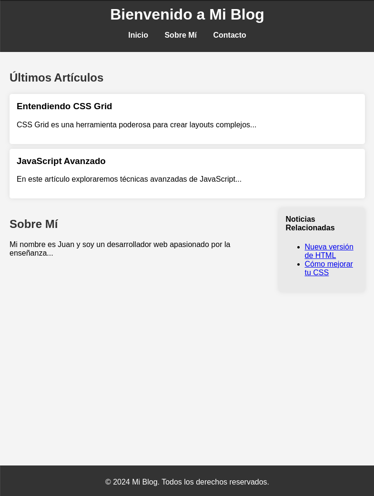

# Página Web HTML semantica

Vista de la pagina que vamos a realizar


### Estructura Básica del Documento

Comenzamos con el esqueleto básico de un documento HTML5.

```html
<!DOCTYPE html>
<html lang="es">
<head>
    <meta charset="UTF-8">
    <meta name="viewport" content="width=device-width, initial-scale=1.0">
    <title>Mi primera página web</title>
</head>    
```

- `<!DOCTYPE html>`: Declara que estamos utilizando HTML5.
- `<html lang="es">`: Define el idioma del documento como español.
- `<head>`: Contiene metadatos y enlaces a recursos externos.
- `<meta charset="UTF-8">`: Especifica la codificación de caracteres como UTF-8.
- `<meta name="viewport" content="width=device-width, initial-scale=1.0">`: Ajusta la escala para dispositivos móviles.
- `<title>Mi primera página web</title>`: Define el título de la página que aparece en la pestaña del navegador.


## Cuerpo del Documento

### Encabezado

```html
<body>
    <header>
        <h1>Bienvenido a Mi Blog</h1>
        <nav>
          <ul>
            <li><a href="#inicio">Inicio</a></li>
            <li><a href="#sobre-mi">Sobre Mí</a></li>
            <li><a href="#contacto">Contacto</a></li>
          </ul>
        </nav>
    </header>
```

- `header`: Contiene el título principal y el menú de navegación.
- `nav ul`: Lista de navegación con enlaces.

### Contenido Principal

#### Sección de Últimos Artículos

```html
    <main>
        <section>
          <h2>Últimos Artículos</h2>
          <article>
            <h3>Entendiendo CSS Grid</h3>
            <p>CSS Grid es una herramienta poderosa para crear layouts complejos...</p>
          </article>
          <article>
            <h3>JavaScript Avanzado</h3>
            <p>En este artículo exploraremos técnicas avanzadas de JavaScript...</p>
          </article>
        </section>
```

- `section`: Contiene artículos recientes.
- `article`: Cada artículo tiene un título (`h3`) y un párrafo (`p`).

#### Sección "Sobre Mí" y Barra Lateral

```html
        <div class="content">
            <section>
                <h2>Sobre Mí</h2>
                <p>Mi nombre es Juan y soy un desarrollador web apasionado por la enseñanza...</p>
            </section>
            <aside>
                <h4>Noticias Relacionadas</h4>
                <ul>
                    <li><a href="#noticia1">Nueva versión de HTML</a></li>
                    <li><a href="#noticia2">Cómo mejorar tu CSS</a></li>
                </ul>
            </aside>
        </div>
    </main>
```

- `div class="content"`: Contenedor para la disposición en dos columnas.
- `section`: Información sobre el autor.
- `aside`: Barra lateral con noticias relacionadas.

### Pie de Página

```html
    <footer>
        <p>&copy; 2024 Mi Blog. Todos los derechos reservados.</p>
    </footer>
</body>
</html>
```

- `footer`: Contiene el texto de derechos de autor.


## Estilos CSS en Línea

Añadimos estilos CSS directamente en el documento HTML dentro del `<style>`.

```html
    <style>
        body {
            font-family: Arial, sans-serif;
            margin: 0;
            padding: 0;
            background-color: #f4f4f4;
        }
```

- `body`: Establece la fuente, los márgenes, el relleno y el color de fondo para toda la página.

### Estilos para el Encabezado

```html
        header {
            background-color: #333;
            color: #fff;
            padding: 10px 0;
        }
        header h1 {
            margin: 0;
            text-align: center;
        }
        nav ul {
            list-style-type: none;
            padding: 0;
            text-align: center;
        }
        nav ul li {
            display: inline;
            margin: 0 15px;
        }
        nav ul li a {
            color: #fff;
            text-decoration: none;
            font-weight: bold;
        }
```

- `header`: Establece el color de fondo, el color del texto y el relleno del encabezado.
- `header h1`: Centra el título y elimina el margen.
- `nav ul`: Elimina el estilo de la lista y centra el contenido.
- `nav ul li`: Hace que los elementos de la lista se muestren en línea y establece el margen.
- `nav ul li a`: Establece el color, elimina el subrayado y hace el texto en negrita.

### Estilos para el Contenido Principal

```html
        main {
            padding: 20px;
        }
        .content {
            display: grid;
            grid-template-columns: 3fr 1fr;
            gap: 20px;
        }
        section {
            margin-bottom: 20px;
        }
        h2 {
            color: #333;
        }
        article {
            background-color: #fff;
            padding: 15px;
            margin-bottom: 10px;
            border-radius: 5px;
            box-shadow: 0 0 10px rgba(0, 0, 0, 0.1);
        }
        article h3 {
            margin-top: 0;
        }
        aside {
            background-color: #e9e9e9;
            padding: 15px;
            border-radius: 5px;
            box-shadow: 0 0 10px rgba(0, 0, 0, 0.1);
        }
        aside h4 {
            margin-top: 0;
        }
```

- `main`: Añade relleno al contenido principal.
- `.content`: Utiliza CSS Grid para crear una disposición de dos columnas con un espacio entre ellas.
- `section`: Añade margen inferior a las secciones.
- `h2`: Cambia el color de los encabezados de nivel 2.
- `article`: Añade fondo blanco, relleno, margen inferior, bordes redondeados y sombra a los artículos.
- `article h3`: Elimina el margen superior de los encabezados de los artículos.
- `aside`: Añade fondo gris claro, relleno, bordes redondeados y sombra a las secciones laterales.
- `aside h4`: Elimina el margen superior de los encabezados de las secciones laterales.

### Estilos para el Pie de Página

```html
        footer {
            background-color: #333;
            color: #fff;
            text-align: center;
            padding: 10px 0;
            position: fixed;
            width: 100%;
            bottom: 0;
        }
    </style>
</head>
```

- `footer`: Añade fondo negro, color blanco, centra el texto, añade relleno y fija la posición del pie de página en la parte inferior de la página.


Ahora sabes cómo estructurar una página con encabezado, contenido principal, barra lateral y pie de página. ¡Espero que esta guía te sea útil y que te animes a crear tu propio blog!

¡Hasta la próxima! 🚀