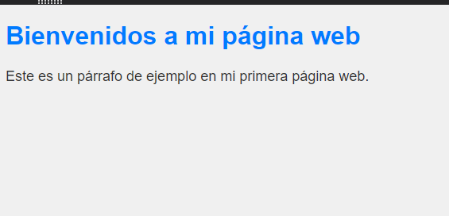
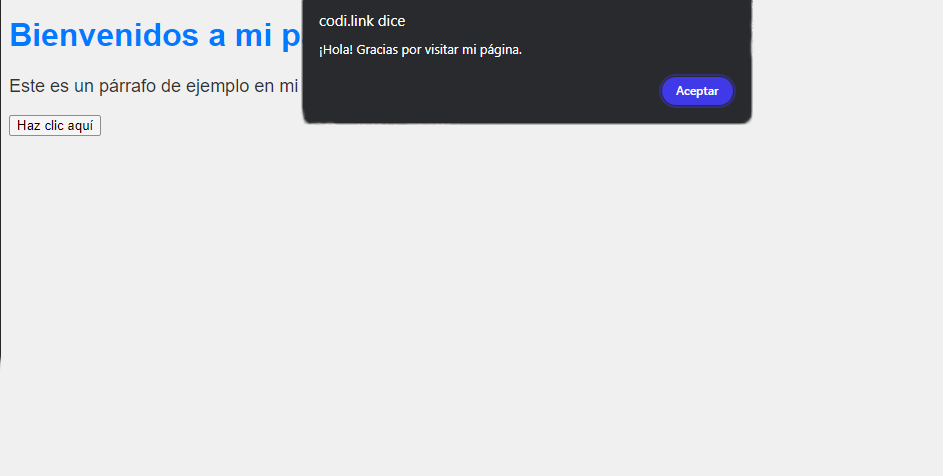

<details>
<summary><h3>MENÚ HTML</h3></summary>

1. [Frontend](#front)
2. [Backend](#backend)
3. [Conclusión Backend y Frontend](#conclusion-front-back)
4. [Página Web](#pagina-web)
5. [Anatomía de la web](#anatomia-web)
6. [IDE Y EDITORES DE CODIGO](#ide-edit)
7. [Mi primera página web](#primera-web)
8. [Etiquetas de Texto](#etiquetas-texto)
9. [UTF-8](#UTF-8)
10. [Etiqueta \<p>](#etiqueta-p)
11. [Etiqueta \<blockquote>](#blockquote)
12. [Etiqueta \<blockquote>](#blockquote)
13. [Etiqueta \<cite>](#cite)
14. [Tablas](#tablas)
15. [Imágenes](#imagen)
16. [Hipervínculos](#hipervinculos)
17. [Marcos](#marcos)
18. [Formularios](#formularios)
19. [Elementos Multimedia](#multimedia)
20. [Scripts](#scripts)
<!-- 10. [Elemento 10](#elemento-10) -->


</details>


# Frontend: La Magia Visible de la Web<a name="front"></a>

Cuando navegas por la web, exploras sitios web y aplicaciones con diseños y funcionalidades únicas. Pero, ¿alguna vez te has preguntado cómo se crea esa parte que ves y con la que interactúas en tu pantalla? Esa parte es el **Frontend**. Profundizaremos en su significado, importancia y cómo tres lenguajes mágicos, HTML, CSS y JavaScript, trabajan en conjunto para dar vida a la experiencia digital que todos disfrutamos.


## ¿Qué es el Frontend?

**Frontend**, también conocido como desarrollo del lado del cliente, es la cara visible de un sitio web o aplicación. Es la parte que los usuarios ven y con la que interactúan directamente. Para comprenderlo mejor, descompondremos sus componentes principales:

### 1. **HTML - La Estructura Mágica**

HTML (HyperText Markup Language) actúa como el esqueleto de una página web. Define la estructura básica de la página, como los títulos, párrafos e imágenes. Es el cimiento sobre el que se construye todo el sitio.

### 2. **CSS - El Estilista Virtuoso**

CSS (Cascading Style Sheets) es como el estilista de la web. Con CSS, puedes agregar colores, fuentes y diseños para hacer que un sitio web sea atractivo visualmente. Es lo que transforma una página web en una obra de arte digital.

### 3. **JavaScript - El Mago de la Interacción**

JavaScript es como el mago que agrega interactividad y funcionalidad. Permite que los botones respondan a tus clics, que las imágenes se deslicen y que el contenido cambie dinámicamente. Es la chispa que convierte una página estática en una experiencia activa y envolvente.


## ¿Para Qué Sirve el Frontend?

El Frontend tiene un propósito fundamental en el mundo digital:

### 1. **Experiencia del Usuario**

El Frontend crea una experiencia agradable para el usuario. Un diseño bien pensado y una navegación intuitiva hacen que los visitantes se sientan cómodos y deseen explorar más.

### 2. **Atracción Visual**

CSS es crucial para captar la atención de los usuarios y transmitir la identidad de una marca. El diseño visual atractivo es como un imán para los visitantes.

### 3. **Interacción Activa**

JavaScript permite la interacción activa. Desde formularios que validan tus datos hasta mapas interactivos, el Frontend hace que los usuarios se involucren y participen en la web.

### 4. **Adaptabilidad**

El Frontend garantiza que un sitio web sea adaptable, funcionando sin problemas en diferentes dispositivos, como computadoras de escritorio, tablets y teléfonos móviles.

#### en resumen:


# Descubriendo el Backend: El Cerebro Oculto de la Web<a name="backend"></a>

Cuando exploramos un sitio web, interactuamos con una interfaz y disfrutamos de su diseño, pero rara vez pensamos en lo que sucede detrás de escena. Aquí es donde entra en juego el **Backend**, una parte esencial pero invisible del desarrollo web que maneja toda la lógica y la funcionalidad que hacen que un sitio web o aplicación funcione. En este texto, exploraremos qué es el Backend, su importancia y cómo trabaja en armonía con el Frontend.

## **¿Qué es el Backend?**

El Backend es como el cerebro oculto de una página web o aplicación. Es el componente que se encarga de todo lo que los usuarios finales no ven: la gestión de bases de datos, el procesamiento de datos ingresados por los usuarios y la ejecución de scripts que hacen posible la funcionalidad del sitio.


Para entenderlo mejor, podemos dividirlo en tres componentes clave:

### **1. Gestión de Bases de Datos**

El Backend se encarga de interactuar con las bases de datos, donde se almacena y recupera información. Esto incluye desde registros de usuarios hasta contenido de productos y más.

### **2. Procesamiento Lógico**

Es responsable de realizar operaciones lógicas y cálculos necesarios para que el sitio web funcione correctamente. Puede abarcar desde la gestión de usuarios y autenticación hasta la generación de contenido dinámico.

### **3. Ejecución de Scripts**

El Backend asegura que los scripts y procesos necesarios para la funcionalidad del sitio se ejecuten sin problemas. Esto incluye la gestión de servidores y recursos para mantener el sitio en funcionamiento.


## **¿Para Qué Sirve el Backend?**

El Backend es como el motor silencioso de un automóvil. Aunque los usuarios no lo ven, es crucial para que todo funcione sin problemas:

### **1. Experiencia del Usuario**

Sin Backend, no habría Frontend. El Backend garantiza que la experiencia del usuario sea óptima, desde la carga rápida de la página hasta la interacción sin problemas.

### **2. Tiempo de Carga y SEO**

El tiempo de carga de una página está relacionado con el Backend. Cuanto más rápido cargue un sitio, mejor será su clasificación en los motores de búsqueda, lo que atraerá a más visitantes.

### **3. Seguridad**

El Backend se encarga de garantizar la seguridad de un sitio web, protegiendo los datos de los usuarios y evitando posibles ciberataques.


### **4. Optimización de Procesos**

Automatiza procesos, lo que facilita la administración de contenidos y la gestión de usuarios, lo que ahorra tiempo y recursos.

## **Frontend vs. Backend: La Combinación Perfecta**

Si el Frontend es la cara amigable de un sitio web, el Backend es su motor invisible pero esencial. Ambos trabajan en conjunto para ofrecer una experiencia completa al usuario. Sin el Backend, el Frontend sería solo una imagen estática sin vida.

## **Ejemplos de Aplicación del Backend**

El Backend se encuentra detrás de muchas de las funciones clave que encuentras en la web:

1. **Inicio de Sesión:** Cuando inicias sesión en un sitio web, el Backend verifica tus credenciales y te permite acceder a tu cuenta.

2. **Carrito de Compras:** El Backend gestiona la funcionalidad del carrito de compras, permitiéndote agregar y eliminar productos.

3. **Cookies:** Las cookies se utilizan para rastrear tus acciones en un sitio web y ofrecerte contenido relevante.

4. **Sistemas de Gestión de Contenido (CMS):** El Backend de un CMS permite a los propietarios de sitios web actualizar su contenido sin necesidad de modificar el código HTML.

5. **Formularios de Contacto:** Cuando completas un formulario de contacto en un sitio web, el Backend asegura que tus datos se envíen correctamente.

## **El Poder del Backend**

El Backend es el componente invisible pero poderoso que hace que la web funcione. Desde la gestión de bases de datos hasta la seguridad y la optimización, es esencial para proporcionar una experiencia de usuario óptima. La próxima vez que navegues por un sitio web, recuerda que detrás de su atractiva interfaz hay un equipo de desarrolladores Backend trabajando arduamente para hacer que todo funcione sin problemas. ¡Disfruta del poder del Backend en cada clic!


## En Conclusión<a name="conclusion-front-back"></a>

El desarrollo web se divide en dos mundos interdependientes: el Frontend y el Backend. El Frontend, como una obra de arte visible, crea la experiencia que disfrutamos al navegar por la web. Es la combinación armoniosa de HTML, CSS y JavaScript que cautiva nuestros sentidos y nos sumerge en un mundo digital atractivo y accesible. Detrás de cada clic, hay un equipo de desarrolladores Frontend trabajando incansablemente para brindarnos la mejor experiencia posible.

Sin embargo, no podemos pasar por alto la importancia del Backend, la parte invisible pero esencial que garantiza que todo funcione sin problemas. Es el motor que impulsa la funcionalidad de un sitio web, asegurando que las bases de datos se gestionen correctamente, que los procesos sean eficientes y seguros, y que la experiencia del usuario sea óptima.


En conjunto, el Frontend y el Backend forman una danza sincronizada en la creación y el mantenimiento de sitios web y aplicaciones. Uno no puede existir sin el otro, y juntos construyen el mundo digital que disfrutamos a diario. Así que la próxima vez que explores la web, recuerda apreciar tanto el arte del Frontend como la potencia del Backend que trabajan en conjunto para brindarte una experiencia digital excepcional.

# El Nacimiento de la Web

En la década de 1990, cuando Tim Berners-Lee publicó la primera página web en el CERN, la web era un lugar muy diferente al que conocemos ahora. Las páginas web consistían principalmente en texto, sin imágenes ni elementos visuales. El lenguaje utilizado para crear estas páginas, conocido como HTML (HyperText Markup Language), estaba en su infancia y solo permitía la presentación de información de manera básica.


Con el paso de los años, el HTML evolucionó y se añadieron nuevas características que revolucionaron la forma en que interactuamos con las páginas web. Se introdujeron elementos como imágenes, tablas y marcos, lo que permitió una mayor diversidad en el diseño y la estructura de las páginas. Los diseñadores gráficos se sumaron al desarrollo web, dando lugar a una nueva disciplina: el diseño web.


A medida que los navegadores web se volvían más potentes y las conexiones a Internet más rápidas, las páginas web comenzaron a transformarse en aplicaciones web. La adición de formularios permitió una mayor interacción entre los usuarios y las páginas, mientras que la incorporación de contenido multimedia como audio, vídeo y animaciones enriqueció la experiencia del usuario.


Hoy en día, las páginas web no solo ofrecen información estática, sino que también son plataformas interactivas que permiten realizar una amplia variedad de tareas, desde enviar correos electrónicos hasta editar vídeos, todo ello directamente desde el navegador web.


## HTML

[HTML EN 3 MINUTOS O MENOS [Video]](/src/video/HTML%20EN%203%20MIN.mp4)

[ORIGEN DE INTERNET](/src/video/HTML%20BASIC.mp4)

[](https://www.youtube.com/watch?v=FId9w-FMJJ0&list=TLPQMjYwOTIwMjNy9lhhDYApsQ&index=10)

-------------------------------------
HTML (Hyper Text Markup Lenguage) es un leguaje de marcado de texto, lo cual nos indica que no es un lenguaje de programación como Java, PHP, C o VisualBasic. HTML es el lenguaje para escribir páginas web. Las marcas, conocidas como etiquetas, describen la forma en la que se estructura el contenido de una página web.

Las etiquetas describen diferentes elementos de la página, por ejemplo, la etiqueta **\<p>** se utiliza para delimitar párrafos de texto y la etiqueta **\** para definir imágenes. El encargado de interpretar estas etiquetas es un programa llamado navegador (browser), por ejemplo, el navegador Chrome de Google o el Firefox de Mozilla. Los archivos que contienen el código HTML tienen la extensión .htm o .html, y son archivos de texto plano (sin formato). Más adelante veremos qué editores se pueden utilizar para crearlos.


El lenguaje HTML es un estándar definido y mantenido por el consorcio internacional World Wide Web Consortium (W3C) creado el 1 de octubre de 1994, por Tim Berners-Lee en el Instituto Tecnológico de Massachusetts (MIT), actual sede central del consorcio.


 

Una página web debe estar escrita en HTML pero también suele incorporar otros elementos como hojas de estilo CSS y programación con el lenguaje Javascript. Con CSS se define el aspecto estético de la página y con Javascript se pueden realizar tareas adicionales cómo abrir y cerrar ventanas, validar los datos introducidos por los usuarios, y otras tareas que requieren ser programadas. El conjunto de HTML, CSS y Javascript es lo que se conoce como front-end o capa de presentación. Esta capa se ejecuta en el navegador, mientras que con back-end o capa de datos se hace referencia a la programación realizada en el servidor con lenguajes de programación web, (Java, PHP, Python, ...) normalmente para obtener y grabar información en una base de datos. Los lenguajes de programación orientados a la web, ejecutados en el servidor, son capaces de generar el código HTML que finalmente se va a ver en el navegador web.

En este curso nos vamos a centrar en el lenguaje HTML y en las hojas de estilo CSS, ya que Javascript entra dentro de otra categoría, la de los lenguajes de programación.

Vamos a presentar las etiquetas de HTML agrupadas en bloques según su uso, veremos primero las más utilizadas, de esta forma iremos creando páginas web sencillas que completaremos progresivamente. Así resultará más fácil entender HTML para alguien que empieza desde cero. 


# Página Web<a name="pagina-web"></a>
Una **página web** es como una ventana mágica que nos conecta con el vasto mundo de Internet. Es un documento digital lleno de maravillas, como texto, imágenes, videos y sonidos, todo organizado de una manera que podemos ver y explorar utilizando un programa especial llamado "navegador web," como Google Chrome o Mozilla Firefox.

Imagina que una página web es como un libro digital, pero con superpoderes. Puede contener información sobre cualquier cosa: noticias, historias, fotos de gatos, recetas de cocina o tutoriales sobre cómo hacer un nudo de corbata. Además, puedes hacer clic en enlaces dentro de la página para viajar instantáneamente a otras páginas web y descubrir aún más cosas emocionantes.

Las páginas web son como piezas de un rompecabezas gigante llamado World Wide Web (WWW). Cada página está escrita en un lenguaje especial llamado HTML o XHTML, que le dice a tu navegador cómo mostrar todo el contenido de la página, desde los encabezados hasta las imágenes y los videos.

Ahora, no todas las páginas web son iguales. Hay dos tipos principales:


1. **Páginas Web Estáticas**: Estas son como fotos en un álbum. Cuando abres una página web estática, tu navegador descarga un archivo que contiene todo lo que necesitas ver en la página. No puedes interactuar mucho con ellas; simplemente las lees y ves las imágenes.


2. **Páginas Web Dinámicas**: Estas son como programas de televisión en vivo. Cuando abres una página web dinámica, tu navegador se comunica con una computadora en algún lugar que genera la página en tiempo real. Puedes hacer cosas geniales en estas páginas, como enviar mensajes, jugar juegos o comprar cosas.


Ah, y una cosa importante: no confundas "página web" con "sitio web." Una página web es como una sola página en un libro gigante, mientras que un sitio web es como todo el libro con muchas páginas web relacionadas entre sí.

Las páginas web son como tesoros digitales llenos de información y entretenimiento. Cada vez que usas Internet, estás explorando un vasto océano de páginas web, y cada una tiene algo único que ofrecer. ¡Así que sigue haciendo clic y descubriendo el mundo mágico de la web!

----
### Hipertexto

¿Qué es el hipertexto? Según el diccionario de la lengua de la Real Academia Española, el hipertexto es un conjunto estructurado de textos, gráficos, etcétera, unidos entre sí por enlaces y conexiones lógicas. A diferencia de un libro, que sigue una organización lineal, el hipertexto permite saltar de un punto a otro dentro del mismo texto o a otros textos a través de referencias. Estos términos relacionados, llamados referencias, enlaces, vínculos o hipervínculos, permiten que la lectura del texto siga diferentes caminos según las preferencias del usuario.

### Hipermedia

El término hipermedia, aunque no figura en el diccionario de la RAE, se puede entender a través del término multimedia. Según la RAE, multimedia significa que utiliza conjunta y simultáneamente diversos medios como imágenes, sonidos y texto, en la transmisión de una información. Un sistema multimedia puede integrar texto, voz, audio, fotografías, gráficos interactivos, vídeos, realidad virtual y otros medios. La hipermedia es, por tanto, la combinación de hipertexto y multimedia: un conjunto estructurado de diversos medios como textos, gráficos, imágenes y sonidos unidos entre sí por enlaces y conexiones lógicas para la transmisión de información.

La web, el sistema más conocido basado en hipertexto y hipermedia, ha llegado a ser sinónimo de estos términos debido a su estructura y capacidad para presentar información de manera flexible y rica en contenido.

# IDE Y EDITORES DE CODIGO<a name="ide-edit"></a>

## ¿Qué es un editor de código?

Es un programa ligero que no exige mucha RAM o procesador, en dónde puedes abrir y crear un archivo a la vez y guardarlo en una carpeta


## ¿Qué es un IDE (Integrated Development Environment)?

Un ambiente de desarrollo integrado, a diferencia de un editor, es un programa más pesado que pide mucha más memoria RAM y un procesador más poderoso, además de que es un espacio para trabajar proyectos completos no solo en archivos, pueden tener un compilador (para los lenguajes compilados), un emulador, control de versiones y terminales.


## IDE VS EDITOR


# Entorno de trabajo

### Editor de Texto

Un editor de texto es un programa que te permite escribir y editar código. A diferencia de los procesadores de texto como Microsoft Word, los editores de texto están diseñados para trabajar con el código de programación y no añaden ningún formato adicional que pueda interferir con el código.

### Elegir el Editor de Texto Adecuado

Hay muchos editores de texto disponibles, cada uno con sus propias características. Aquí te presentamos algunos de los más populares entre los desarrolladores web:

### Visual Studio Code (VS Code) </img>

Visual Studio Code es un editor de texto gratuito y de código abierto desarrollado por Microsoft. Es muy popular entre los desarrolladores web debido a su potente conjunto de características.

- **Resaltado de Sintaxis**: Resalta diferentes partes de tu código con colores, lo que facilita la lectura.
- **Autocompletado**: Sugerencias inteligentes mientras escribes.
- **Extensiones**: Gran cantidad de extensiones disponibles para agregar funcionalidad adicional.


### Sublime Text </img>

Sublime Text es otro editor de texto muy popular. Es conocido por su velocidad y su interfaz de usuario elegante.

- **Selecciones Múltiples**: Edita muchas líneas de código al mismo tiempo.
- **Goto Anything**: Navega rápidamente a cualquier archivo, símbolo o línea.
- **Modo Distraction-Free**: Modo de pantalla completa sin distracciones.


### Atom </img>


Atom es un editor de texto gratuito y de código abierto desarrollado por GitHub. Es altamente personalizable y tiene una gran comunidad de usuarios.

- **Control de Git Integrado**: Perfecto para trabajar con repositorios de GitHub.
- **Temas Personalizables**: Cambia el aspecto del editor con temas.
- **Paquetes**: Miles de paquetes disponibles para ampliar sus funcionalidades.


----

### Estructura de Carpetas Básica:

Crea una carpeta en donde vas a realizar tu poyecto de página web


crea tu archivo index que será tu archivo principal y una carpeta llamada "Assets" donde irán los complementos de tu página web como imágenes y estilos


dentro de la carpeta de Assets creamos las siguientes carpetas con forme se vayan necesitando


### HTML: La Estructura de la Web

Los lenguajes de etiquetas, o lenguajes de marcado, nos permiten estructurar un documento mediante el uso de etiquetas. A diferencia de los lenguajes de programación, los lenguajes de marcado no definen funciones aritméticas ni el uso de variables. El lenguaje de marcas más conocido es el HTML (HyperText Markup Language), creado por Tim Berners-Lee a inicios de los 90 como un subconjunto de SGML (Standard Generalized Markup Language). HTML es una de las piedras angulares de la World Wide Web, permitiendo crear páginas web enlazadas entre sí y accesibles desde internet.

HTML ha evolucionado considerablemente, con HTML5 siendo su versión más reciente. HTML5 destaca por sus características semánticas, capacidades multimedia, nuevas funciones para formularios y su integración con tecnologías que mejoran la arquitectura de las aplicaciones web.

Aquí tienes un ejemplo básico de un documento HTML:

```html
<!DOCTYPE html>
<html lang="es">
<head>
    <meta charset="UTF-8">
    <meta name="viewport" content="width=device-width, initial-scale=1.0">
    <title>Mi Primera Página Web</title>
</head>
<body>
    <h1>Bienvenidos a mi página web</h1>
    <p>Este es un párrafo de ejemplo en mi primera página web.</p>
</body>
</html>
```


## 3. CSS: El Estilo de la Web

Cascading Style Sheets (CSS) es lo que hace que las páginas web se vean bonitas. Controla el diseño visual y la presentación. Aquí hay un ejemplo de cómo podemos estilizar la página anterior:

```html
<head>
    <style>
        body {
            font-family: Arial, sans-serif;
            background-color: #f0f0f0;
            color: #333;
        }
        h1 {
            color: #007bff;
        }
        p {
            font-size: 18px;
        }
    </style>
</head>
```



En este ejemplo, estamos definiendo estilos directamente en el documento HTML. Sin embargo, es una buena práctica tener estos estilos en un archivo CSS separado para mantener el código organizado.

## 4. JavaScript: La Interactividad de la Web

JavaScript es el lenguaje de programación que permite la interactividad en las páginas web. Desde validar formularios hasta crear animaciones complejas, JavaScript es esencial para una experiencia de usuario dinámica. Aquí hay un ejemplo simple:

```html
<body>
    <h1>Bienvenidos a mi página web</h1>
    <p>Este es un párrafo de ejemplo en mi primera página web.</p>
    <button onclick="mostrarMensaje()">Haz clic aquí</button>

    <script>
        function mostrarMensaje() {
            alert('¡Hola! Gracias por visitar mi página.');
        }
    </script>
</body>
```


En este ejemplo, cuando el usuario hace clic en el botón, aparece un mensaje de alerta.

## Estructura de carpetas

¿Por Qué Es Importante la Estructura de Carpetas?
Una estructura de carpetas bien organizada te ayuda a:

Mantener el orden: Facilita la localización de archivos específicos.
Mejorar la colaboración: Facilita que otros desarrolladores comprendan tu proyecto.
Aumentar la escalabilidad: Permite agregar nuevas características sin caos.
Optimizar el mantenimiento: Simplifica la actualización y corrección de errores.


---

## ¿Qué son las Etiquetas HTML?

El HTML, o HyperText Markup Language, es el lenguaje estándar para crear páginas web. Se compone de una serie de etiquetas o marcas que el navegador web entiende y usa para renderizar el contenido de una página. Estas etiquetas están encerradas entre los signos `<>` y generalmente vienen en pares: una etiqueta de apertura y una etiqueta de cierre, como `<etiqueta></etiqueta>`. Entre estas etiquetas se encuentra el contenido, que puede ser texto, imágenes u otras etiquetas.

### Sintaxis Básica

La estructura básica de una etiqueta HTML es la siguiente:

```html
<etiqueta>
  Contenido de la etiqueta
</etiqueta>
```

Sin embargo, hay algunas etiquetas que no requieren una etiqueta de cierre ni contenido. Por ejemplo, la etiqueta `<br>` que inserta un salto de línea.


n HTML5, hay una amplia variedad de etiquetas que nos permiten estructurar y organizar el contenido de nuestras páginas web. Aquí te presentamos algunas de las más usadas:

- **`<a>`**: Define y da forma a un ancla o enlace.
- **`<abbr>`**: Introduce una abreviatura.
- **`<address>`**: Especifica un elemento de dirección.
- **`<article>`**: Define una parte independiente del contenido de un documento, como una entrada de blog.
- **`<aside>`**: Define contenido aparte del contenido principal, como una barra lateral.
- **`<audio>`**: Permite introducir un archivo de audio.
- **`<br>`**: Inserta un solo salto de línea.
- **`<button>`**: Especifica un botón pulsador.
- **`<canvas>`**: Se utiliza para representar gráficos de mapa de bits dinámicos.
- **`<div>`**: Define una sección en un documento HTML.
- **`<form>`**: Para introducir formularios.
- **`<footer>`**: Representa el pie de una sección, con información adicional.
- **`<header>`**: Representa un grupo de artículos introductorios o de navegación.
- **`<hgroup>`**: Sirve para crear el encabezado de una sección.
- **`<h1>`** a **`<h6>`**: Especifica encabezados del nivel 1 al nivel 6.
- **``**: Introduce una imagen.
- **`<nav>`**: Define una sección del documento destinada a la navegación.
- **`<p>`**: Etiqueta usada para párrafos de texto.
- **`<script>`**: Sirve para introducir un script.
- **`<section>`**: Define una sección genérica para un documento.


## Elementos en Bloque y Elementos en Línea

Todos los elementos HTML se dividen en dos categorías principales: elementos en bloque y elementos en línea.

### Elementos en Bloque

Los elementos en bloque estructuran la parte principal de la página web, dividiéndola en bloques coherentes. Siempre comienzan con una nueva línea y ocupan todo el ancho de la página web. Algunos ejemplos de elementos en bloque son:

```html
<p>Este párrafo es un elemento en bloque.</p>
<article>
  <h1>Encabezado de Artículo</h1>
  <p>Contenido del artículo...</p>
</article>
```

### Elementos en Línea

Los elementos en línea diferencian partes de un texto dado y le proporcionan una función particular. No comienzan con una nueva línea y ocupan solo el ancho necesario. Son usados principalmente con otros elementos. Algunos ejemplos de elementos en línea son:

```html
<p>Texto normal y... <b>Texto en negrita</b></p>
<a href="https://ejemplo.com">Esto es un enlace</a>
```

## Atributos en HTML

Los atributos en HTML son palabras especiales usadas dentro de la etiqueta de apertura para controlar el comportamiento del elemento. Proveen información adicional sobre el elemento. Cada atributo tiene un nombre y un valor:

```html
<elemento atributo="valor">Contenido del elemento</elemento>
```

### Ejemplos de Atributos

- **`id`**: Identifica un elemento único.
- **`class`**: Identificador múltiple.
- **`style`**: Aplica estilos al contenido.
- **`href`**: Define la URL para un enlace.
- **`src`**: Especifica la fuente de una imagen.
- **`height`** y **`width`**: Determinan la altura y el ancho de un elemento.

### Ejemplo Práctico

Veamos un ejemplo práctico usando la etiqueta `<a>` con el atributo `href`:

```html
<a href="https://pilares.cdmx.gob.mx/inicio">Esto es un link</a>
```

Y un ejemplo usando la etiqueta `` con los atributos `src`, `height` y `width`:

```html

```

---
# Anatomía de la web<a name="anatomia-web"></a>


La anatomía de una página web es como el esqueleto que da forma y estructura a un cuerpo, y cada elemento cumple un papel esencial en la experiencia del usuario. Aquí te presento los componentes básicos que conforman la anatomía de una página web:

1. **Contenedor**: Imagina el contenedor como el lienzo en blanco donde se construye toda la página. Es el espacio que sostiene y delimita todos los demás elementos.

2. **Header (Encabezado)**: El encabezado es como la portada de un libro, es lo primero que ves. Normalmente, contiene la información de identificación de la marca o producto y la navegación, como un mapa que te guía a través de la página.

3. **Navigation (Navegación)**: La navegación es como un mapa del tesoro que te permite moverte por la página. Aquí se encuentran los hipervínculos que te llevan a diferentes partes del sitio web.

4. **Main Content (Contenido Principal)**: Este es el corazón de la página, donde se presenta la información más importante. Es como el capítulo principal de un libro, lleno de texto, imágenes, videos y otros tipos de contenido.

5. **Sidebar (Barra Lateral)**: La barra lateral es como una sección adicional que muestra información relevante pero no tan importante como el contenido principal. Puede contener enlaces útiles o anuncios.

6. **Footer (Pie de Página)**: El pie de página es como la conclusión de un libro, donde se encuentra información adicional, como enlaces secundarios o detalles de contacto. Es como el cierre perfecto para una página web.


Es importante destacar que aunque esta estructura es la más común, no todas las páginas web siguen exactamente la misma anatomía. Cada sitio web puede personalizar su estructura para adaptarse a su propósito y diseño. Por ejemplo, algunas páginas web pueden tener elementos adicionales o diferentes disposiciones según su contenido específico.


La anatomía de una página web es como una obra de arte, con cada elemento desempeñando un papel crucial en la experiencia del usuario. Al entender esta estructura básica, podemos apreciar cómo los diseñadores web crean experiencias únicas en línea para que todos las disfrutemos.


# **Introducción a las Etiquetas HTML y Estructura Básica de una Página Web**<a name="Introduccion-Etiquetas"></a>

**Introducción**

¡Bienvenidos al emocionante mundo de la creación de páginas web! En esta serie de sesiones educativas, te guiaremos a través de los fundamentos de HTML, el lenguaje que se utiliza para construir sitios web. Comenzaremos desde cero y te mostraremos cómo crear tu propia página web. Hoy, en nuestra primera sesión, aprenderemos sobre las etiquetas HTML y la estructura básica de una página web.

### Etiquetas

Las etiquetas (marcas) delimitan cada uno de los elementos que componen un documento HTML.

El lenguaje HTML se basa en etiquetas, por eso es importante entender bien la sintaxis de las etiquetas. El siguiente esquema muestra las partes de una etiqueta HTML genérica.

<!-- [](https://postimg.cc/phmgbNkj) -->


La etiqueta de apertura está delimitada por el signo < "menor que", a continuación el propio nombre de la etiqueta (en este caso p), y opcionalmente, un atributo (en este caso class="fondo"), finalmente el signo > "mayor que".

A continuación está el texto del contenido de la etiqueta, lo más frecuente es un texto, pero podría ser otra etiqueta, una imagen, ...

La etiqueta de cierre está delimitada por el signo < "menor que", a continuación la barra inclinada /, el propio nombre de la etiqueta (en este caso p), y finalmente el signo > "mayor que".

Algunas etiquetas no tienen contenido, y se cierran sobre sí mismas, no tienen etiqueta de cierre, se llaman etiquetas vacías, como la etiqueta ``<br>``. En estas etiquetas opcionalmente se puede colocar una barra justo antes del signo >, por ejemplo: ``<br />``. La etiqueta ``<br>`` produce un salto de línea. Las etiquetas vacías no tienen contenido pero si pueden tener atributos. Algunas otras etiquetas vacías son  ``<hr>``, ````, ``<input>``, ``<link>``, ``<meta>``, ``<param>`` y ``<source>``.

En una etiqueta, la primera palabra que aparece es el nombre de la etiqueta. También podemos encontrar atributos con sus valores, siguiendo el formato ``<etiqueta atributo1="valor" atributo2="valor">``. La forma más correcta es escribir el nombre de la etiqueta y los atributos en minúscula, y los valores entre comillas dobles.

Por ejemplo, ``<a href="https://www.conversa.com.mx">Visita Conversa\</a>``

Produce este resultado en el navegador:

[Visita Conversa](https://www.conversa.com.mx)

Si un atributo tiene más de un valor, se escriben todos los valores dentro de las mismas comillas, separados por espacios en blanco, por ejemplo ``<etiqueta atributo="valor1 valor2">``.

En general las etiquetas se pueden anidar pero no se pueden 'cruzar'. Estas dos etiquetas \<p> y \<div>, están anidadas correctamente:

```html
<div>
<p>
Texto del párrafo
</p>
</div>
```
Es incorrecto cruzarlas así:
```html
<div>
<p>
Texto del párrafo
</div>
</p>
```

La sintaxis de las etiquetas HTML ha sufrido variaciones a lo largo del tiempo y hay etiquetas que ya no está recomendado su uso. Por esto se pueden encontrar páginas web antiguas cuyo código HTML no se considera correcto hoy en dia, sin embargo, esas páginas siguen funcionando y mostrando el contenido para el que fueron diseñadas.

Por otro lado, los navegadores pueden obviar pequeños errores y mostrar la página correctamente, como si no tuviera esos errores.

Para ver los errores de una página web existen validadores de código HTML, como el de W3C, que nos muestran los errores indicando su grado de gravedad.


# Etiquetas básicas

A continuacion se da una lista de etiquetas y parametros usados en HTML5

| Etiquetas | Parámetros | Para qué sirve…                                                                           | 
|-----------|------------|-------------------------------------------------------------------------------------------|
| \<p>       |            | Salto de parrafo                                                                          |
| \<br>      |            | Salto de línea                                                                            | 
| \<pre>     |            | Formato predeterminado, es decir, que respete los saltos de parrafo y espacios del texto  |
| \     |            | Insertar una imagen                                                                       |
|           | src        | Especificar la dirección o ruta de la imagen                                              | 
|           | alt        | Texto alternativo (aparece al colocar el puntero del ratón sobre la imagen)               | 
|           | width      | Ancho de la imagen, sus unidades están dadas en pixeles                                   | 
|           | height     | Alto de la imagen, sus unidades estan dadas en pixeles                                    | 
| \<ol>      |            | Listas  numeradas u ordenadas                                                             | 
|      | reversed | Indica que la numeración  debe ser descendente y su valor  es reversed (\<ol> reversed="reversed")                                                                                    |   
|      | start    | Espécifica el valor inicial de una lista (\<ol start="23">)                                                                                                                           |   
|      | type     | Especifica el tipo de número que se utilizará en la lista, los valores pueden ser: 1,A,a,I,i                                                                                         |  
| \<ul> |          | Listas no ordenadas o con viñetas                                                                                                                                                    |   
| \<li> |          | Permite definir los elementos de las listas numeradas y no numeradas                                                                                                                 | 
|      | value    | Especifica el valor de un elemento de la lista                                                                                                                                       |   
| \<a>  |          | Estable un vinculo desde una pagina web a otra                                                                                                                                       |   
|      | href     | Especifica la dirección URL (\<a href="www.ccpm.com.mx">Visita el sitio de CCPM</a>)                                                                                                  |  
|      | rel      | Especifica la relacón  entre el documento actual y el documento vinculado, y sus valores pueden ser: alternate, author, bookmark, help, license, next, nofollow, search, tag, prev.  |   
|      | target   | Especifica dónde se abrirá el documento vinculado, y sus valores pueden ser: _blank, _parent, _self, _top.                                                                          |  
| \<html>      |          | Representa la raiz del documento, es decir, es el contenedor de todos los demas elementos de html                       |
|             | manifest | Especifica la dirección del documento en la memoria caché, para navegar sin conexión, y sus valor es una dirección URL  |
|             | lang     | Especifica el idioma del contenido                                                                                      |
| \<table>     |          | Define una tabla                                                                                                        |
|             | border   | Un grosor para el borde de la tabla (\<table border="5">)                                                                |
| \<tr>        |          | Define una fila de la tabla                                                                                             |
| \<td> o \<th> |          | Define una celda. \<td> define una celda normal. \<th> define una celda de tipo cabecera (en negritas y centrado)          |
|             | colspan  | Indica el numero de columnas que la celda debe abarcar                                                                  |
|             | rowspan  | Indica  el numero de filas que una celda debe abarcar                                                                   |
| \<caption>   |          | Define un titulo para la tabla, se inserta despues de la etiqueta \<table>                                               |
| \<dl>        |            | Define una lista de definiciones. Esta etiqueta se utiliza junto con \<td> y \<dd>                  |
| \<dt>        |            | Define un termino en una lista de definiciones                                                    |
| \<dd>        |            | Define la descripcion del termino en una lista de definiciones                                    |
| \<h1> a \<h6> |            | Define un encabezado de tipo 1 a 6                                                                |
| \<b>         |            | Define un texto en negritas                                                                       |
| \<hr>        |            | Inserta una linea horizontal. Se utiliza para separar visualmente el contenido de una pagina web  |
| \<body>      |            | Inicia el cuerpo de la pagina                                                                     |
|             | bgcolor    | Indica un color de fondo, este puede ser el nombre en ingles o bien el valor hexadecimal          |
|             | Background | Especifica una imagen de fondo, su valor es una direccion URL donde se encuentra la imagen        |
| \<figure>    |            | Marcar una foto en un documento                                                                   |
| \<dl>     |        | Define una lista de definiciones. Esta etiqueta se utiliza junto con \<td> y \<dd>   |
| \<dt>     |        | Define un termino en una lista de definiciones                                     |
| \<dd>     |        | Define la descripcion del termino en una lista de definiciones                     |
| \<div>    |        | Insertar un recuedro dentrro de la pagina, es una forma de division en una pagina  |
| \<canvas> |        | Dibuja un lienzo                                                                   |
|          | width  | Ancho del lienzo                                                                   |
|          | height | Alto del lienzo                                                                    |


----


## Estructura básica de la página

La primera línea  ``<!DOCTYPE ... >`` no es propiamente una etiqueta de HTML, sino una declaración o instrucción al navegador sobre la versión de HTML que utiliza la página. Para la versión HTML 5, el tipo de documento es html: ``<!DOCTYPE html>``

El resto del documento HTML está contenido dentro de la etiqueta ``<html></html>``. Para indicar el idioma es conveniente añadir el atributo lang="es": ``<html lang="es"></html>``

Dentro de la etiqueta \<html>, encontramos dos subdivisiones, la cabecera, delimitada por las etiquetas ``<head></head>`` y el cuerpo, delimitado por las etiquetas ``<body></body>``. Por lo tanto, el aspecto básico de cualquier página web, es el siguiente:

```html
<!DOCTYPE html>
<html>
	<head>
		...
	</head>
	<body>
		...
	</body>
</html>
```

La etiqueta \<head> contiene información sobre la página. Por ejemplo contiene etiquetas que pueden decir de qué trata la página, el título que debe de mostrar en la barra del navegador, o código javascript y estilos, que pueden estar en el propio encabezado o como enlaces a otros archivos. Normalmente, lo que contiene esta etiqueta no se muestra en el navegador, es una etiqueta que contiene declaraciones sobre la página pero no contenido propiamente dicho como texto o imágenes.

Las etiquetas que pueden ir dentro de \<head> son \<title> \<style> \<base> \<link> \<meta> \<script> \<noscript>. Iremos viendo estas etiquetas a medida que nos hagan falta ya que ahora no seríamos capaces de entender bien su significado en todos los casos. De momento sólo comentaremos que obligatoriamente debe de contener la etiqueta ``<title></title>``, que contiene el título de la página, que es lo que se ve en la barra de título del navegador. En nuestro ejemplo de la unidad anterior el título era "Mi primera página"


Dentro de \<head>, para optimizar la página para diferentes anchos de pantalla, también es conveniente definir el viewport, por ejemplo de esta forma: ``<meta name="viewport" content="vwidth=device.width, initial-scale=1.0">``.

En el \<body> encontramos el contenido de la página, lo que se ve a través del navegador: texto, imágenes, enlaces, tablas, etc... Por lo tanto dentro del \<body> pueden ir la gran mayoría de las etiquetas html.

# Etiquetas de Texto<a name="etiquetas-texto"></a>


Como estamos diciendo todo el texto de la página estará dentro del **\<body>**, el texto dentro del **\<body>** debe estar, principalmente, dentro de párrafos. En HTML, los párrafos se identifican con la etiqueta `<p></p>`. Dentro de los párrafos colocaremos texto e imágenes, y algunas etiquetas que nos permitan dar formato al texto. Dentro de un párrafo no debe haber otros párrafos anidados.

A su vez, dentro del **\<body>**, disponemos de encabezados que nos permiten organizar los títulos o rótulos del texto. Los encabezados van desde el `<h1></h1>` de mayor tamaño, al `<h6></h6>`, el más pequeño. Por ejemplo, utilizaríamos un **\<h1>** para poner el rótulo principal de la página, **\<h2>** para los títulos de los apartados, **\<h3>** para los apartados de segundo nivel, etc. El propio texto de cada apartado iría fuera del encabezado contenido en párrafos `<p></p>` u otras etiquetas.

Una de las peculiaridades del texto, es que los espacios en blanco consecutivos y saltos de línea no se muestran como en el código fuente. Si hay varios espacios seguidos, sólo se mostrará uno. Por ejemplo, si en el código fuente escribimos `Bienvenido a    Conversa` se verá Bienvenido a Conversa. Si queremos poner varios espacios seguidos, utilizaremos el código html para el espacio, **\&nbsp**;

El navegador también ignora los saltos de línea. Así si dentro de un párrafo colocamos varios saltos de línea pulsando Intro, estos no se verán. Para crear un salto de línea dentro de un párrafo, utilizamos la etiqueta `<br />`.

Cada etiqueta `<p></p>` lleva implicito un salto de línea.

Veremos con más detalle y ejemplos la etiqueta ``<p>``, un poco más adelante

Otras formas de agrupar el contenido dentro de la página web es con las etiquetas ``<div>`` y ``<span>``. La etiqueta ``<div>`` se utiliza a nivel de bloque y la etiqueta ``<span>`` a nivel de línea o palabras. Estas etiquetas son básicamente contenedores genéricos de contenido. El contenido se escribe entre las etiquetas de apertura y de cierre ``<div>`` contenido ``</div>``, el criterio para agrupar contenido no está definido estrictamente, por lo tanto podemos utilizarlas para lo que queramos, por ejemplo para dar estilo al contenido.

Podríamos decir que las etiquetas ``<div>`` y ``<span>`` son unas etiquetas neutras dentro de la semántica de HTML. Por el contrario, en HTML 5 han surgido nuevas etiquetas semánticas para agrupar el contenido según su significado. Estas nuevas etiquetas a nivel de bloque son, ``section`` para secciones, ``article`` para artículos, ``header`` para cabeceras, ``nav`` para menús, ``footer`` para pies de página y ``aside`` para contenido en el lateral. A nivel de línea o texto tenemos muchas etiquetas semánticas como ``strong``, ``em``, ``cite``. A lo largo del curso iremos viéndolas con detalle.

El uso de estas nuevas etiquetas semánticas no es obligatorio, pero sí recomendable, sobre todo para tener la información mejor estructurada y también para que los buscadores sean capaces de identificar mejor el contenido de nuestra página. Resumiendo, lo recomendable es utilizar las etiquetas semánticas y en los casos en los que no exista una etiqueta semántica apropiada utilizar etiquetas ``<div>`` y ``<span>``.

Otras etiquetas para agrupar y organizar el contenido (texto, imágenes, ...) en formatos estructurados son las listas (ul, ol, li) y las tablas (table, tr, td)

# UTF-8 <a name="UTF-8"></a>


En el mundo del desarrollo web, la codificación de caracteres es esencial. Para garantizar que tu sitio web pueda mostrar texto en diferentes idiomas y caracteres especiales, necesitas especificar la codificación adecuada. Es aquí donde entra en juego la etiqueta `<meta charset="UTF-8">`.


**UTF-8** es una codificación de caracteres universalmente aceptada que puede representar una amplia gama de caracteres, desde letras y números hasta símbolos y caracteres especiales de diversos idiomas. Esto significa que puedes crear una página web que sea accesible para audiencias de todo el mundo, sin importar qué idioma hablen.

## Evitar problemas de visualización

Si alguna vez has visitado un sitio web y has visto caracteres extraños o símbolos ilegibles en lugar de texto, es probable que el problema estuviera relacionado con la codificación de caracteres. Al utilizar `<meta charset="UTF-8">`, estás asegurando que tu página web se muestre correctamente, independientemente de los idiomas o caracteres especiales que utilices.


Para asegurarte de que la etiqueta `<meta charset="UTF-8">` surta efecto, colócala en la sección `<head>` de tu documento HTML. Esto es importante porque le dice al navegador qué codificación de caracteres debe utilizar desde el principio.

```html
<!DOCTYPE html>
<html>
<head>
    <meta charset="UTF-8">
    <!-- Otras etiquetas <meta> y contenido del <head> aquí -->
</head>
<body>
    <!-- Contenido de la página aquí -->
</body>
</html>
```

## Comentarios

Los comentarios se utilizan para documentar un código o simpelmente para que el navegador ignore las lineas documentadas.

Para agregar comentarios en un documento debe colocar un signo de admiración seguido de dos guiones, en seguida el comentario y finalice con dos guiones más, ``<!--Coemtnarios-->``

## Etiqueta \<p><a name="etiqueta-p"></a>

La etiqueta \<p> define un párrafo.

Ejemplo: ``<p>Un párrafo de texto</p>``

Produce este resultado:

Un párrafo de texto

La etiqueta \<p> es de tipo bloque, es decir, por defecto ocupa una línea completa en la página web. Además, también incluye un margen superior e inferior. Por ejemplo, si escribimos dos párrafos en la misma línea: ``<p>Un párrafo de texto.</p><p>Otro párrafo.</a>``

Produce este resultado:

```
Un párrafo de texto.

Otro párrafo.
```

Si el contenido del párrafo no cabe en una línea será el navegador web quien lo divida en varias líneas según el ancho disponible. Por lo tanto, el número de líneas que ocupe un párrafo dependerá del ancho disponible. Si queremos incluir un salto de línea explícito dentro de un párrafo podemos utilizar la etiqueta \<br />. Como ya hemos dicho, los saltos de línea que escribamos en el código html no tienen efecto al mostrar la página.

Por ejemplo, en este fragmento de código html hay dos párrafos que se pueden ver de forma diferente según el ancho del navegador.


Si el ancho es pequeño, el primer párrafo ocupa cuatro líneas.


Si el ancho es mayor, el primer párrafo ocupa tres líneas,


También podemos ver cómo la línea en blanco que aparece en el código antes de "Es útil ..." y los espacios en blanco detrás de "del tipo Hoja" no se muestran en la página web.

Observa que entre los dos párrafos se crea un salto de línea y además un margen de separación, mientras que en el salto de línea creado con la etiqueta \<br /> no existe ese margen.

Dentro del párrafo se suele introducir texto pero también se pueden incluir otros elementos, como imágenes y elementos de texto (span, em, b, etc.), aunque no se pueden incluir listas y tablas.

* Atributos. Hasta la aparición de la versión HTML 5, existía el atributo align para alinear el contenido del párrafo, con los valores rigth, center, left.

Ejemplo: ``<p align="right">Contenido alineado a la derecha</p>``

<block>
<div class="demoWeb">
     <p align="right">Contenido alineado a la derecha</p>
   </div>

 

A partir de HTML 5, se debe alinear el contenido desde la hoja de estilo con el atributo text-align y los valores rigth, center, left, justify, initial, inherit.

## Texto preformateado \<pre>

La etiqueta \<pre> define texto preformateado, es decir, que conserva los espacios y saltos de línea presentes en el código html.

Ejemplo:

``<pre>Aquí hay más   de un espacio
``

``
y un salto de línea</pre>``

Produce este resultado:

<pre>Aquí hay  más   de un espacio

y un salto de línea</pre>

Por defecto, el navegador presenta el texto de esta etiqueta en una fuente de la familia monospace (Courier).

Esta etiqueta de utiliza cuando queremos que el navegador muestre los espacios y saltos de línea, como en un poema, datos en forma de tabla, etc. Por ejemplo:

<pre> Semifinal A   Semifinal B
  	 \          /
  	  \        / 
  	   \      /
  	 Final 15 Julio</pre>


## Etiqueta \<blockquote><a name="blockquote"></a>
La etiqueta ``<blockquote>`` se utiliza para definir un texto o cita que proviene de otra página web. Con el atributo ``cite`` se indica esa página web, aunque este no es visible para el usuario.

Ejemplo:

```html
<blockquote cite="https://www.aulaclic.es/internet/t_4_1.htm"> A veces resulta muy gratificante encontrar algo que ni siquiera sabíamos que existía y que supera nuestras expectativas. Es uno de los motivos por los que Internet engancha a la gente. Es como encontrarse frente a un gigantesco basurero y en la primera patada encontrar un diamante.</blockquote>
```

Produce este resultado:

<blockquote cite="https://www.aulaclic.es/internet/t_4_1.htm"> A veces resulta muy gratificante encontrar algo que ni siquiera sabíamos que existía y que supera nuestras expectativas. Es uno de los motivos por los que Internet engancha a la gente. Es como encontrarse frente a un gigantesco basurero y en la primera patada encontrar un diamante.</blockquote>

* Atributos: cite valor: URL

## Etiqueta \<cite><a name="cite"></a>
La etiqueta ``<cite>`` se utiliza para citar un titulo en una obra creativa (Novela, película, canción, ...) Normalmente los navegadores visualizan la cita en tipo de letra cursiva.

Ejemplo:
```html
<p> El famoso cuadro <cite>Gernika</cite> fue pintado por P. Picasso en 1937.</p>
```

<p> El famoso cuadro <cite>Gernika</cite> fue pintado por P. Picasso en 1937.</p>

No hay que confundir esta etiqueta ``<cite>`` con el atributo ``cite`` que acabamos de ver en la etiqueta ``<blockquote>``.

---

# Tablas<a name="tablas"></a>

¡Hola a todos los entusiastas del desarrollo web!. Nos centraremos en las **Tablas**, las **Listas** y los **Caracteres Especiales**. ¡Prepárate para sumergirte en estos conceptos esenciales con ejemplos claros!

## ¿Qué son las Tablas en HTML?

Imagina que estás creando una página web y deseas mostrar información en forma de filas y columnas, similar a una hoja de cálculo o una tabla en un documento. Aquí es donde entran en juego las tablas en HTML. Una tabla es una estructura rectangular que se compone de filas y columnas, permitiéndote organizar tus datos de manera ordenada y comprensible.

## Conceptos Fundamentales

Las tablas son una excelente manera de organizar datos en tu sitio web. Antes de profundizar en las etiquetas y atributos, es importante entender algunos conceptos clave:

- **Fila:** Una fila en una tabla es como una línea horizontal de celdas. Cada celda contiene información.
- **Columna:** Una columna es una serie vertical de celdas que comparten el mismo contenido o tipo de datos.
- **Tabla:** Es la estructura que contiene filas y columnas.

## Creando una Tabla Básica

Para crear una tabla en HTML, utilizamos las etiquetas `<table>`, `<tr>`, `<th>`, y `<td>`. Aquí tienes un ejemplo simple:

```html
<table>
  <tr>
    <th>Nombre</th>
    <th>Edad</th>
  </tr>
  <tr>
    <td>Juan</td>
    <td>25</td>
  </tr>
  <tr>
    <td>Maria</td>
    <td>30</td>
  </tr>
</table>
```

En este ejemplo, `<table>` define la tabla en sí, `<tr>` crea filas, `<th>` se utiliza para encabezados de columna, y `<td>` para datos de la tabla. ¡Así de simple!


### Atributos de Tabla

Los atributos de una tabla permiten personalizar su apariencia. Aquí hay algunos ejemplos:

- **Color:** Cambiar el color de fondo de la tabla.
- **Bordes (border):** Definir el grosor y estilo de los bordes de las celdas.
- **Alineación (align):** Alinear la tabla a la izquierda, derecha o centro.
- **Anchura (width):** Establecer el ancho de la tabla en píxeles o porcentaje.

Ejemplo:

```html
<table border="1" bgcolor="lightgray" align="center" width="80%">
   <!-- Filas y celdas de la tabla aquí -->
</table>
```
## Agregando Estilo a tu Tabla

Para hacer que tu tabla se vea más atractiva, puedes aplicar estilos CSS. Aquí tienes un ejemplo de cómo puedes hacer que tu tabla tenga un aspecto más agradable:

```html
<style>
  table {
    width: 100%;
    border-collapse: collapse;
  }

  th, td {
    padding: 8px;
    text-align: left;
    border-bottom: 1px solid #ddd;
  }

  th {
    background-color: #f2f2f2;
  }

  tr:hover {
    background-color: #f5f5f5;
  }
</style>
```

Con estos estilos, tu tabla se verá mucho más profesional.


## Colspan y Rowspan

Para una mayor flexibilidad, puedes fusionar celdas horizontalmente (`colspan`) o verticalmente (`rowspan`). Esto es útil cuando deseas combinar celdas para formar una única entidad.

Ejemplo:

```html
<table border="1">
   <tr>
       <td>Uno</td>
       <td colspan="2">Dos y Tres</td>
   </tr>
   <tr>
       <td rowspan="2">Cuatro y Seis</td>
       <td>Cinco</td>
       <td>Siete</td>
   </tr>
</table>
```


## Tablas Anidadas

Las tablas también pueden anidarse dentro de otras tablas. Esto es útil cuando deseas organizar datos de manera más avanzada. Aquí tienes un ejemplo:

```html
<table>
  <tr>
    <th>Nombre</th>
    <th>Contacto</th>
  </tr>
  <tr>
    <td>Juan</td>
    <td>
      <table>
        <tr>
          <td>Email: juan@example.com</td>
          <td>Teléfono: 123-456-7890</td>
        </tr>
      </table>
    </td>
  </tr>
</table>
```


## Listas Numeradas y Viñetas

Las listas son útiles para presentar información de manera ordenada. Hay dos tipos principales: listas numeradas y listas con viñetas.

### Etiquetas de Listas

- `<ul>`: Lista sin numerar (viñetas).
- `<ol>`: Lista numerada.
- `<li>`: Elemento de la lista.

Ejemplo:

```html
<ul>
   <li>Elemento 1</li>
   <li>Elemento 2</li>
   <li>Elemento 3</li>
</ul>

<ol>
   <li>Primero</li>
   <li>Segundo</li>
   <li>Tercero</li>
</ol>
```


## Etiqueta Marquee: ¡Movimiento en tu Página!

<i>¿Listos para aprender cómo hacer que tu texto se desplace de manera elegante? ¡Comencemos!</i>

¿Qué es la Etiqueta ``<marquee>``?
La etiqueta ``<marquee>`` en HTML se utiliza para crear efectos de desplazamiento de texto o imágenes en una página web. Es como si tu contenido estuviera en movimiento, lo que puede ser útil para resaltar información importante o simplemente para agregar un toque de dinamismo a tu sitio.

## Creando un Texto en Movimiento

Para usar la etiqueta `<marquee>`, solo necesitas rodear el contenido que deseas que se desplace con esta etiqueta. Veamos un ejemplo simple:

```html
<marquee>¡Este texto se desplaza de manera automática!</marquee>
```

El resultado será un texto que se desplaza horizontalmente de derecha a izquierda en tu página web. ¡Es así de sencillo!

## Personalizando el Desplazamiento

La etiqueta `<marquee>` te permite agregar contenido en movimiento a tu página. Puedes controlar la dirección, el color de fondo, la altura y otros atributos.

Ejemplo:

```html
<marquee direction="up" scrollamount="3">Texto que sube y baja</marquee>
```

En este ejemplo, hemos configurado la dirección en "up" para que el texto se desplace hacia arriba y abajo. El atributo `scrollamount` controla la velocidad del desplazamiento.

## Haciendo que el Contenido Sea Interactivo

Si deseas dar a tus usuarios más control sobre el contenido en movimiento, puedes agregar la propiedad `behavior`. Por ejemplo:

```html
<marquee behavior="alternate" direction="right" scrollamount="2">¡Texto de ida y vuelta!</marquee>
```

El valor "alternate" hace que el texto se mueva en ambas direcciones, de izquierda a derecha y viceversa, creando un efecto de ida y vuelta.

## Caracteres Especiales

A veces, necesitas mostrar caracteres especiales como acentos o símbolos en tu página. Utiliza códigos especiales para representarlos.

Ejemplo:

```html
<p>Los caracteres especiales como &aacute;, &eacute;, &iacute;, &oacute;, &uacute; se utilizan para mostrar acentos.</p>
<p>Los símbolos como &lt; y &gt; se muestran como &lt; y &gt;.</p>
```

Para un mayor entendimiento revisa la documentacion de este tema haciendo clic 👉👉<a href="./Document/Caracteres especiales.md">aquí</a>👈👈

---

En ocasión, exploraremos conceptos emocionantes que te permitirán dar vida a tu sitio web con **imágenes**, crear **hipervínculos** para la navegación y entender el mundo de los **marcos**. Vamos a sumergirnos en estos temas con ejemplos prácticos.

## Imágenes: Visualiza tus Ideas<a name="imagen"></a>

## ¿Qué es la Etiqueta ``?

La etiqueta `` es una de las etiquetas más esenciales en HTML, ya que nos permite incrustar imágenes en nuestras páginas web. Sin ella, el internet sería un lugar mucho menos visual y atractivo. 

## Insertando una Imagen Básica

La sintaxis básica de la etiqueta `` es bastante sencilla. Para insertar una imagen en tu página web, necesitas especificar el atributo `src` (fuente), que indica la ubicación de la imagen que deseas mostrar. Aquí tienes un ejemplo:

```html

```


El atributo `alt` se utiliza para proporcionar una descripción de la imagen, lo cual es importante para la accesibilidad y para que los motores de búsqueda entiendan el contenido de la imagen.


## Controlando el Tamaño de la Imagen

Si deseas ajustar el tamaño de la imagen, puedes utilizar los atributos `width` (ancho) y `height` (alto). Por ejemplo:

```html

```

Estos atributos te permiten especificar las dimensiones en píxeles de la imagen.

Las imágenes son una parte esencial de cualquier sitio web. Con la etiqueta ``, puedes incorporar imágenes en tu página HTML. Aquí hay algunos conceptos clave:

- **Texto Alternativo:** Escribir un texto alternativo es importante para la accesibilidad y la descripción de la imagen.
- **Borde de Imagen:** Puedes agregar bordes a las imágenes.
- **Alineación:** Controla la alineación de la imagen en relación con el texto circundante.
- **Imagen de Fondo:** Utiliza imágenes como fondos para elementos HTML.

Ejemplo:

```html

```

```html
<h6>IMAGENES</h6>
<p>Explora el poder de HTML5 con estas imágenes:</p>

<p>HTML5, el corazón de la web moderna.</p>

<p>Creado por Yuuta Senpai</p>
```


## Imágenes Responsivas

En la era de la web móvil, es crucial que nuestras imágenes se adapten a diferentes tamaños de pantalla. Para lograrlo, puedes usar el atributo `srcset` para proporcionar varias versiones de la imagen y dejar que el navegador elija la más adecuada. Veamos un ejemplo:

```html

```

## Imágenes enlazadas

A menudo, queremos que las imágenes sean enlaces a otras páginas o recursos. Puedes lograrlo alrededor de la etiqueta ``, como este ejemplo:

```html
<a href="pagina-enlazada.html">
  
</a>
```

## Hipervínculos: Navegación en la Web<a name="hipervinculos"></a>

vamos a explorar la versátil etiqueta `<a>` en HTML, que nos permite crear hipervínculos y llevar a los usuarios a diferentes destinos en la web. 

## ¿Qué es la Etiqueta `<a>`?

La etiqueta `<a>`, que significa "ancla," es una de las etiquetas más cruciales en HTML, ya que nos permite crear enlaces o hipervínculos en nuestras páginas web. Estos enlaces pueden llevar a otras páginas web, archivos, direcciones de correo electrónico y más.

## Creando un Hipervínculo Básico

La sintaxis básica de la etiqueta `<a>` es sencilla. Para crear un enlace, necesitas especificar el atributo `href` (hipervínculo), que indica la URL o la ubicación del recurso al que deseas enlazar. Aquí tienes un ejemplo:

```html
<a href="https://www.ejemplo.com">Visita Ejemplo.com</a>
```

Los hipervínculos, o enlaces, son lo que hacen que la web sea interactiva. Puedes vincular a otras páginas, sitios web o recursos. Algunos conceptos clave:

- **Tipos de Enlaces:** Enlaces a páginas internas o externas.
- **Marcadores e Hipervínculos:** Puedes enlazar a secciones específicas en la misma página.
- **Atributos de los Hipervínculos:** Controla cómo se abre el enlace y más.

## Hipervínculos Internos y Referencias Relativas

Además de enlazar a sitios web externos, puedes crear hipervínculos internos que lleven a diferentes partes de la misma página o a otras páginas dentro de tu sitio. Para ello, utilizamos las referencias relativas y los marcadores.

### Referencias Relativas

## ¿Qué son las Referencias URL Relativas?

Las referencias URL relativas son un método inteligente para definir enlaces a recursos en la web utilizando direcciones más cortas y contextuales en lugar de URLs completas. Estas direcciones dependen de la ubicación del archivo que contiene la referencia relativa. ¡Vamos a desentrañar cómo funcionan!

## En el Mismo Directorio

Supongamos que tienes una estructura de directorios y archivos como la que se muestra en el servidor www.conversa.com.mx:

```
www.conversa.com.mx
├── windows-10
│   ├── menu.htm
│   ├── escritorio.htm
├── excel-2016
│   ├── informacion.htm
│   ├── ejercicios
│       ├── datos.htm
```

Si estás en el mismo directorio y deseas enlazar a otro archivo, ¡no necesitas escribir toda la URL! Puedes simplemente usar el nombre del archivo. Por ejemplo:

```html
<a href="escritorio.htm">Enlace al escritorio</a>
```

## En un Directorio Inferior

Cuando deseas enlazar a un archivo en un directorio inferior, debes escribir el nombre del directorio seguido de una barra (/) y el nombre del archivo. Por ejemplo:

```html
<a href="ejercicios/datos.htm">Ejercicios de datos</a>
```

## En un Directorio Superior

Si el archivo al que deseas enlazar está en un directorio superior, puedes utilizar `../` para retroceder un nivel y luego especificar la ruta al archivo. Por ejemplo:

```html
<a href="../excel-2016/informacion.htm">Información sobre Excel 2016</a>
```

## En el Directorio Raíz

Si deseas enlazar a un archivo en el directorio raíz del servidor, simplemente coloca una barra (/) antes del nombre del archivo o la ruta. Por ejemplo:

```html
<a href="/index.htm">Página de inicio</a>
```

## Omitir el Nombre del Archivo

Al igual que con las URLs absolutas, si omites el nombre del archivo en una referencia relativa, se asumirá que se refiere a `index.html` (o `index.htm`). Por ejemplo:

```html
<a href="/">Página principal</a>
```

## Puntos de Anclaje

Los puntos de anclaje te permiten enlazar a secciones específicas dentro de un documento. Simplemente agrega `#nombre_del_ancla` a la URL y asegúrate de que la sección de destino tenga un `id="nombre_del_ancla"`. Por ejemplo:

```html
<a href="#referencia_relativa">Enlace a la Referencia URL Relativa</a>
```

En el párrafo de destino:

```html
<p id="referencia_relativa">...</p>
```

## Atributos Adicionales

La etiqueta `<a>` ofrece una variedad de atributos adicionales para personalizar y mejorar la experiencia del usuario:

- **`target`**: Este atributo controla cómo se abre el enlace. Por ejemplo, `target="_blank"` abrirá el enlace en una nueva ventana o pestaña del navegador.

- **`title`**: Este atributo proporciona información adicional cuando se pasa el cursor sobre el enlace, lo que puede ser útil para describir el destino del enlace.

La etiqueta `<a>` en HTML nos permite crear hipervínculos que conectan nuestra página web con otros recursos en línea. Puedes enlazar a sitios web externos, crear hipervínculos internos usando referencias relativas y marcadores, y personalizar la experiencia del usuario con atributos adicionales. Así que adelante, crea enlaces poderosos y guía a tus usuarios por la vasta red de la web. ¡El mundo digital está a solo un clic de distancia!

## Marcos I: Estructurando con Frames<a name="marcos"></a>

Los marcos te permiten dividir una página en secciones independientes con contenido diferente. Para ello, utilizamos la etiqueta `<frameset>`. Algunos conceptos:

- **Rows y Cols:** Divide la página en filas o columnas.
- **Name, Src, Scrolling:** Controla el contenido de cada marco.
- **Noresize, Frame Border:** Ajusta el tamaño y los bordes de los marcos.

Ejemplo:

```html
<frameset rows="50%, 50%">
   <frame name="izquierda" src="pagina1.html">
   <frame name="derecha" src="pagina2.html">
</frameset>
```

## ¿Qué es la Etiqueta `<frameset>`?

La etiqueta `<frameset>` es parte fundamental de HTML y se utiliza para definir la estructura de una página web dividida en varios marcos o frames. Los frames permiten mostrar múltiples documentos HTML en una sola página, lo que puede ser útil para diseñar sitios web con contenido dinámico.

## Creando un Conjunto de Marcos

La sintaxis básica de la etiqueta `<frameset>` es simple. Aquí hay un ejemplo de cómo crear un conjunto de marcos:

```html
<frameset cols="25%, 75%">
  <frame src="menu.html">
  <frame src="contenido.html">
</frameset>
```

En este ejemplo, estamos dividiendo la página en dos columnas: la primera columna ocupa el 25% del ancho y muestra "menu.html", mientras que la segunda columna ocupa el 75% y muestra "contenido.html". Cada `<frame>` representa una región o marco en la página.

## Marcos II: Detalles Adicionales

Siguiendo con los marcos, aquí hay más detalles para que entiendas mejor:

- **Frame, Marginwidth, Marginheight:** Controla el tamaño y márgenes de los marcos.
- **Target:** Define dónde se abrirá el enlace (en el mismo marco o en uno nuevo).
- **Marcos Anidados:** Puedes tener marcos dentro de otros marcos.

Ejemplo:

```html
<frame src="contenido.html" marginwidth="10" marginheight="20">
<a href="pagina.html" target="_blank">Abrir en una nueva ventana</a>
```

## Especificando Tamaños y Distribución

Puedes controlar el tamaño y la distribución de los marcos utilizando los atributos `cols` (columnas) y `rows` (filas) en la etiqueta `<frameset>`. Estos atributos aceptan valores en píxeles o porcentajes para definir el tamaño de cada marco.

Por ejemplo, aquí hay un conjunto de marcos con tres filas de altura variable:

```html
<frameset rows="100,*,200">
  <frame src="encabezado.html">
  <frame src="contenido.html">
  <frame src="pie.html">
</frameset>
```

## Creando un Diseño de Marcos Anidados

Además de los diseños simples de dos o tres columnas, también puedes anidar conjuntos de marcos para crear diseños más complejos. Esto te permite dividir tu página en varias secciones y cargar diferentes documentos HTML en cada una.

```html
<frameset cols="25%,*">
  <frame src="menu.html">
  <frameset rows="50%,50%">
    <frame src="noticias.html">
    <frame src="anuncios.html">
  </frameset>
</frameset>
```

## Marcando el Fin de `<frameset>`

Es importante recordar que la etiqueta `<frameset>` ha quedado obsoleta en HTML5, y se recomienda utilizar alternativas más modernas como CSS y JavaScript para crear diseños web flexibles y receptivos. Sin embargo, aún puedes encontrar sitios web que utilizan esta técnica.

---

# Formularios: Capturando Información<a name="formularios"></a>

En esta ocasión, nos sumergiremos en el fascinante mundo de los formularios en HTML. Los formularios son una parte esencial de la web moderna, permitiéndonos interactuar con los usuarios y recopilar información valiosa. Vamos a explorar cómo crearlos y personalizarlos.

Los formularios son una parte esencial de la interacción en línea, ya que permiten a los usuarios ingresar y enviar datos. Veamos algunos conceptos clave:

- **¿Qué son los Formularios?** Son elementos interactivos que permiten a los usuarios enviar información.
- **Crear un Formulario:** Utilizamos la etiqueta `<form>` para iniciar un formulario.
- **Elementos de un Formulario:** Cuadros de texto, áreas de texto, botones, etc.
- **Enviar Información por Correo Electrónico:** Configura tu formulario para que los datos se envíen por correo electrónico.


## ¿Qué Son los Formularios en HTML?

Los formularios son elementos interactivos que permiten a los usuarios ingresar datos y enviarlos a un servidor web. Puedes usar formularios para crear encuestas, registrarse en sitios web, enviar mensajes y mucho más.


## Elementos del Formulario

### Etiqueta `<form>`

La etiqueta `<form>` es el contenedor principal de un formulario. Contiene todos los elementos del formulario y puede tener dos atributos clave: `action` (la URL del servidor que procesará los datos) y `method` (el método HTTP utilizado para enviar los datos, generalmente `post` o `get`).

```html
<form action="procesar.php" method="post">
  <!-- Elementos del formulario se colocan aquí -->
  <input type="text" name="nombre" placeholder="Tu nombre">
  <input type="email" name="correo" placeholder="Tu correo electrónico">
  <button type="submit">Enviar</button>
</form>
```

### Elementos de Entrada

Los elementos de entrada permiten a los usuarios ingresar datos. 

## Cuadros de Texto: Capturando Texto

Los cuadros de texto son una forma común de recopilar texto ingresado por los usuarios. Aquí algunos conceptos:

- **Qué es un Cuadro de Texto:** Un campo donde los usuarios pueden escribir texto.
	- `<input type="text">` para texto.
	- `<input type="password">` para contraseñas.
	- `<input type="email">` para direcciones de correo electrónico.
- **Propiedades del Cuadro de Texto:** Tamaño, longitud máxima, etc.
	- `required`: Hace que un campo sea obligatorio.
	- `maxlength` y `minlength`: Define la longitud máxima y mínima del texto.
	- `pattern`: Permite especificar un patrón (expresión regular) que el valor debe seguir.
	- `placeholder`: Muestra un texto de ejemplo dentro del campo.
	- `disabled`: Desactiva un campo para que no se pueda editar.
- **Atributos del Cuadro de Texto:** `<input type="text">`, `<input type="password">`.
- **Cuadros de Texto con Contraseña:** Para ingresar contraseñas de forma segura.

Ejemplo:

```html
<input type="text" name="usuario" size="30" maxlength="50" placeholder="Usuario">
<input type="password" name="contrasena" placeholder="Contraseña">
```


## Grandes Áreas de Texto: Espacio para Comentarios

Las áreas de texto permiten a los usuarios ingresar texto más largo, como comentarios o mensajes. Aquí lo que necesitas saber:

- **Seleccionar y Crear Áreas de Texto:** Utiliza `<textarea>` para crear áreas de texto.
- **Bloqueo de Área:** Controla si los usuarios pueden editar el texto.
	- `disabled`: Desactiva un campo para que no se pueda editar.

Ejemplo:

```html
<textarea name="comentario" rows="4" cols="50" readonly>Escribe aquí tus comentarios...</textarea>
```

## Botones y Casillas de Verificación: Interacción Adicional

Los botones y las casillas de verificación agregan interactividad a tus formularios. Algunos conceptos:

- **Tipos de Botones:** `<input type="button">`, `<input type="submit">`.
- **Casillas de Verificación:** Para opciones múltiples, como "Acepto los términos y condiciones".
	- `<input type="checkbox">` para casillas de verificación.

Ejemplo:

```html
<input type="button" value="Cancelar">
<input type="checkbox" name="aceptar" value="si"> Acepto los términos y condiciones
```

## Menús: Navegación y Selección

Los menús te permiten crear listas de opciones para que los usuarios naveguen o hagan selecciones. Algunos conceptos:

- **Crear un Menú:** Utiliza las etiquetas `<select>` y `<option>` para crear menús.
- **Menú Desplegable:** Permite a los usuarios seleccionar una opción de una lista desplegable.

La etiqueta `<select>` crea menús desplegables y la etiqueta `<option>` define las opciones dentro de ellos. Son ideales para seleccionar elementos de una lista predefinida.

Ejemplo:

```html
<select name="paises">
   <option value="usa">Estados Unidos</option>
   <option value="canada">Canadá</option>
   <option value="mexico">México</option>
</select>
```

## Ejemplo de Formulario Completo

```html
<form action="procesar.php" method="post">
  <label for="nombre">Nombre:</label>
  <input type="text" id="nombre" name="nombre" required>
  
  <label for="correo">Correo Electrónico:</label>
  <input type="email" id="correo" name="correo" required>
  
  <label for="edad">Edad:</label>
  <input type="number" id="edad" name="edad" min="18" max="99" required>
  
  <label for="intereses">Intereses:</label>
  <select id="intereses" name="intereses">
    <option value="musica">Música</option>
    <option value="deporte">Deporte</option>
    <option value="arte">Arte</option>
  </select>
  
  <label for="comentario">Comentario:</label>
  <textarea id="comentario" name="comentario" rows="4" cols="50"></textarea>
  
  <button type="submit">Enviar</button>
</form>
```


#### Tabla de parametros de ``<input>``

|Atributos|Valores|Descripción|
|:----|:----|:----|
|accept|audio/*|Especifica los tipos de archivos que el servidor acepta (solo para type="file")|
| |video/*| |
| |image/*| |
| |MIME_type| |
|align|left|Especifica la alineación|
| |right| |
| |top| |
| |middle| |
| |bottom| |
|alt|text|Especifica un texto alternative solo para imágenes (type="image")|
|checked|Checked|Especifica que un elemento ``<input>`` debe ser preseleccionado cuando se carga la pagina (type="checkbox" o type="radio")|
|disabled|disabled|Especifica sii el elemento ``<input>`` sera deshabilitado|
|size|numero|Especifica el ancho en caracteres de un elemento ``<input>``|
|src|Direccion URL|Especifica la direccion URL de la imagen que desea utilizar como un boton de envio (solo para type ="image")|
|type|button|Especifica el tipo de entrada para mostrar|
| |checkbox| |
| |color| |
| |date| |
| |datetime| |
| |datetime-local| |
| |email| |
| |file| |
| |hidden| |
| |image| |
| |month| |
| |number| |
| |password| |
| |radio| |
| |range| |
| |reset| |
| |search| |
| |submit| |
| |tel| |
| |text| |
| |time| |
| |url| |
| |week| |
|autocomplete|on|Especifica si un elemento ``<input>`` debe tener habilitada la funcion autocompletar|
| |off| |
|autofocus|autofocus|Especifica si un elemento ``<input>`` debe recibir automaticamente el foco cuando se carga la pagina|
|form|Identificador de form|Especifica uno o mas formularios al que pertenece el elemento ``<input>``|
|formaaction|Direccion URL|Especifica la direccion URL del archivo que va a procesar el control de entrada cuando se envia el formulario (por type="submit" o type="image")|
|formnovalidate|formnovalidate|Define que los elementos del formulario no deben ser validados cuando son enviados|
|formtarget|_blank|Especifica donde se mostrará la respuesta que se recibe despues de enviar el formulario (por type="submit" o type="image")|
| |_self| |
| |_parent| |
| |_top| |
| |Nombre del frame| |
|height|valor en pixeles|Especifica el alto  de un elemento ``<input>`` (solo para type="image")|
|width|valor en pixeles|Especifica el ancho  de un elemento ``<input>`` (solo para type="image")|
|list|identificador del datalist|Se refiere a un elemento ``<datalist>`` que contiene opciones  predefinidas para un elemento ``<input>``|
|max|number date|Especifica el valor maximo para un elemento ``<input>``|
|min|number date|Especifica el valor minimo para un elemento ``<input>``|
|maxlength|numero|Especifica el numero maximo de caracteres permitidos en un elemento ``<input>``|
|multiple|multiple|Especifica que el usuario puede introducir mas de un valor en un elemento ``<input>``|
|pattern|Expresion regular|Especifica una expresion regular que se compara  con el valor del elemento ``<input>``|
|placeholder|texto|Especifica un texto predeterminado que se escribe el valor  esperado de un elemento ``<input>``|
|required|required|Especifica que un campo de entrada debe ser completado antes de enviar el formulario|
|step|numero|Especifica los intervalos de numeros reales para un campo de entrada|


#### atributo en la etiqueta `<input>`:

1. **accept**:
   ```html
   <input type="file" accept="audio/*">
   <input type="file" accept="video/*">
   <input type="file" accept="image/*">
   <input type="file" accept="application/pdf">
   ```

2. **align**:
   ```html
   <input type="text" align="left">
   <input type="text" align="right">
   <input type="text" align="top">
   <input type="text" align="middle">
   <input type="text" align="bottom">
   ```

3. **alt**:
   ```html
   <input type="image" src="submit_button.png" alt="Enviar">
   ```

4. **checked**:
   ```html
   <input type="checkbox" checked>
   <input type="radio" checked>
   ```

5. **disabled**:
   ```html
   <input type="text" disabled>
   ```

6. **size**:
   ```html
   <input type="text" size="30">
   ```

7. **src**:
   ```html
   <input type="image" src="submit_button.png">
   ```

8. **type**:
   ```html
   <input type="button" value="Click me">
   <input type="checkbox">
   <input type="color">
   <input type="date">
   <input type="datetime-local">
   <input type="email">
   <input type="file">
   <input type="hidden">
   <input type="image" src="submit_button.png">
   <input type="month">
   <input type="number">
   <input type="password">
   <input type="radio">
   <input type="range">
   <input type="reset">
   <input type="search">
   <input type="submit" value="Submit">
   <input type="tel">
   <input type="text">
   <input type="time">
   <input type="url">
   <input type="week">
   ```

9. **autocomplete**:
   ```html
   <input type="text" autocomplete="on">
   <input type="text" autocomplete="off">
   ```

10. **autofocus**:
    ```html
    <input type="text" autofocus>
    ```

11. **form**:
    ```html
    <form id="form1">
      <input type="text" form="form1">
    </form>
    ```

12. **formaaction**:
    ```html
    <input type="submit" formaction="submit_page.php">
    ```

13. **formnovalidate**:
    ```html
    <input type="submit" formnovalidate>
    ```

14. **formtarget**:
    ```html
    <input type="submit" formtarget="_blank">
    <input type="submit" formtarget="_self">
    <input type="submit" formtarget="_parent">
    <input type="submit" formtarget="_top">
    <input type="submit" formtarget="frame_name">
    ```

15. **height**:
    ```html
    <input type="image" src="submit_button.png" height="100">
    ```

16. **width**:
    ```html
    <input type="image" src="submit_button.png" width="100">
    ```

17. **list**:
    ```html
    <input type="text" list="datalist1">
    <datalist id="datalist1">
      <option value="Option 1">
      <option value="Option 2">
      <option value="Option 3">
    </datalist>
    ```

18. **max**:
    ```html
    <input type="number" max="10">
    <input type="date" max="2023-12-31">
    ```

19. **min**:
    ```html
    <input type="number" min="1">
    <input type="date" min="2023-01-01">
    ```

20. **maxlength**:
    ```html
    <input type="text" maxlength="10">
    ```

21. **multiple**:
    ```html
    <input type="file" multiple>
    ```

22. **pattern**:
    ```html
    <input type="text" pattern="[A-Za-z]{3}">
    ```

23. **placeholder**:
    ```html
    <input type="text" placeholder="Enter your name">
    ```

24. **required**:
    ```html
    <input type="text" required>
    ```

25. **step**:
    ```html
    <input type="number" step="2">
    <input type="time" step="60">
    ```

¡Felicidades! Ahora tienes una comprensión sólida de cómo trabajar con formularios, cuadros de texto, botones, casillas de verificación y menús en HTML.

---

# Elementos Multimedia: Enriqueciendo la Experiencia<a name="multimedia"></a>

Los elementos multimedia son esenciales para hacer que tu sitio web sea atractivo y dinámico. Aquí tienes algunos conceptos clave:

- **¿Qué son los Elementos Multimedia?** Son componentes que enriquecen la experiencia del usuario con sonidos, videos y más.
- **Multimedia en una Página Web:** Cómo integrar sonidos y videos de manera efectiva en tu sitio.
- **Sonidos y Videos:** Los componentes más comunes de multimedia.

#### Tabla de etiquetas

|Etiquetas|Parámetros|Para qué sirve…|
|:----|:----|:----|
|\<audio>| |Inserta contenido de audio|
|\<video>| |Inserta videos o peliculas|
|\<source>| |Inserta multiples recursos multimedia para las etiquetas de ``<audio>`` y ``<video>``|
| |Src|Especifica la ruta del archivo de audio o video|
| |Type|Especifica el tipo de archivo de audio o video|
|\<embed>| |Inserta un contenedor para una aplicación externa o contenido interactivo como un pligin o un archivo de flash|
| |src|Indica la ruta del archivo externo|
| |height|Alto del contenedor|
| |width|Ancho del contenedor|
|\<article>| |Indica un autocontenide independiente para mensajes, noticias o comentarios|
| |contenteditable|Especifica si el contenido de la etiqueta se puede editar o no|
| |contextmenu|Especifica el menu contextual de un elemento|
|\<bdi>| |Aislamiento bidimencional, por ejemplo, cuando se define una lista se puede aislar parte del elemento|
|\<comand>| |Define un comando (una casilla de verificacion o boton de comando) que el usuario puede invocar|
|\<details>| |Especifica otros detalles que el usuario puede mostrar u ocultar|
| |open|Especifica que el detalle sera visible para el usuario|
|\<dialog>| |Define un cuadro de dialogo o ventana|
|\<summary>| |Define un titulo visible en la etiqueta ``<details>`` Al titulo se puede hacer clic para ver u ocultar los detalles|
|\<figure>| |Especifica un contenido libre como ilustraciones, diagramas, fotos, listas de codigo, etc.|
|\<figcaption>| |Define un titulo para la etiqueta ``<figure>``|
|\<mark>| |Define un resaltado para el texto especificado|
|\<meter>| |Define una medida escalar dentro de un rango conocido, o un valor fraccionario. Esto tambien s econoce como un indicador|
| |max|Indica el valor maximo|
| |min|Indica el valor minimo|
| |high|Especifica el intervalo de un valor alto|
| |low|Especifica el intervalo de un valor bajo|
|\<progress>| |Representa el progreso de una tarea|
| |max|Especifica la cantidad de tarea que se requiere como maxima|
| |value|Especifica la cantidad de tarea que se ha completado|
|\<time>| |Define correctamente una hora (reloj de 24 horas)|
| |datetime|Da la fecha u hora que se especifique con el formato YYYY-MM-DDThh:mm:ssTZD|


## La Etiqueta `<audio>`

La etiqueta `<audio>` es la clave para incorporar audio en tu página web. Aquí tienes un ejemplo básico:

```html
<audio controls>
  <source src="musica.mp3" type="audio/mpeg">
  Tu navegador no soporta el elemento de audio.
</audio>
```

- `controls`: Este atributo agrega controles de reproducción como botones de reproducción, pausa y volumen, lo que permite a los usuarios controlar la reproducción del audio.
- `<source>`: Esta etiqueta se utiliza para especificar la fuente del audio y el tipo MIME (Multipurpose Internet Mail Extensions). De esta manera, puedes proporcionar múltiples formatos de audio para que los navegadores los elijan según su compatibilidad.

## La Etiqueta `<video>`

La etiqueta `<video>` es tu boleto de entrada para agregar videos a tus páginas web. Aquí tienes un ejemplo básico:

```html
<video controls width="400" height="300">
  <source src="video.mp4" type="video/mp4">
  Tu navegador no soporta el elemento de video.
</video>
```

- `controls`: Este atributo agrega controles de reproducción, como botones de reproducción, pausa y volumen, para que los usuarios puedan interactuar con el video.
- `width` y `height`: Estos atributos te permiten establecer el ancho y el alto del área donde se mostrará el video.
- `<source>`: Esta etiqueta se utiliza para especificar la fuente del video y el tipo MIME (Multipurpose Internet Mail Extensions), lo que permite a los navegadores elegir la fuente adecuada según su compatibilidad.


#### Ejemplos de multimedia

1. **\<audio>**:
   ```html
   <audio controls>
     <source src="audio_file.mp3" type="audio/mpeg">
     <source src="audio_file.ogg" type="audio/ogg">
     Your browser does not support the audio element.
   </audio>
   ```

2. **\<video>**:
   ```html
   <video width="320" height="240" controls>
     <source src="movie.mp4" type="video/mp4">
     <source src="movie.ogg" type="video/ogg">
     Your browser does not support the video tag.
   </video>
   ```

3. **\<source>** (used within `<audio>` or `<video>`):
   ```html
   <audio controls>
     <source src="audio_file.mp3" type="audio/mpeg">
     <source src="audio_file.ogg" type="audio/ogg">
     Your browser does not support the audio element.
   </audio>

   <video width="320" height="240" controls>
     <source src="movie.mp4" type="video/mp4">
     <source src="movie.ogg" type="video/ogg">
     Your browser does not support the video tag.
   </video>
   ```

4. **\<embed>**:
   ```html
   <embed src="flash_file.swf" width="400" height="300">
   ```

5. **\<article>**:
   ```html
   <article contenteditable="true" contextmenu="menu1">
     <h1>My Article</h1>
     <p>This is an editable article.</p>
   </article>

   <menu type="context" id="menu1">
     <menuitem label="Edit" onclick="editArticle()"></menuitem>
     <menuitem label="Delete" onclick="deleteArticle()"></menuitem>
   </menu>
   ```

6. **\<bdi>**:
   ```html
   <p>In this list, the order of names will be preserved:</p>
   <ul>
     <li>User 1: <bdi>User1name</bdi></li>
     <li>User 2: <bdi>User2name</bdi></li>
   </ul>
   ```

7. **\<command>**:
   ```html
   <command label="Save" icon="save.png" onclick="saveDocument()">
   <command type="checkbox" label="Autosave" onclick="toggleAutosave()">
   ```

8. **\<details>**:
   ```html
   <details open>
     <summary>More Details</summary>
     <p>Here are the details you can now see!</p>
   </details>
   ```

9. **\<dialog>**:
   ```html
   <dialog open>
     <p>This is a dialog box.</p>
     <button onclick="this.parentElement.close()">Close</button>
   </dialog>
   ```

10. **\<summary>**:
    ```html
    <details>
      <summary>Summary of details</summary>
      <p>Detailed information goes here.</p>
    </details>
    ```

11. **\<figure>**:
    ```html
    <figure>
      
      <figcaption>This is a caption for the image.</figcaption>
    </figure>
    ```

12. **\<figcaption>**:
    ```html
    <figure>
      
      <figcaption>This is a caption for the image.</figcaption>
    </figure>
    ```

13. **\<mark>**:
    ```html
    <p>This is a <mark>highlighted</mark> text.</p>
    ```

14. **\<meter>**:
    ```html
    <meter value="0.6" min="0" max="1" high="0.8" low="0.2"></meter>
    ```

15. **\<progress>**:
    ```html
    <progress value="70" max="100"></progress>
    ```

16. **\<time>**:
    ```html
    <time datetime="2023-12-31T23:59:59Z">December 31, 2023, 23:59:59</time>
    ```


# Contenedores Semánticos en HTML


En HTML, los contenedores semánticos son elementos que aportan un significado claro y específico al contenido que encierran. Estos elementos permiten a los navegadores y a las herramientas de accesibilidad entender mejor la estructura y el propósito de la página web. Entre los contenedores semánticos más comunes encontramos:

- `<header>`
- `<nav>`
- `<main>`
- `<section>`
- `<article>`
- `<aside>`
- `<footer>`

## ¿Por Qué Son Importantes?

### Mejora de la Accesibilidad

Los contenedores semánticos ayudan a las tecnologías de asistencia, como los lectores de pantalla, a interpretar y navegar por el contenido de manera más eficiente. Por ejemplo, un lector de pantalla puede anunciar a un usuario que está entrando en la navegación (`<nav>`) o en una sección principal de contenido (`<main>`), facilitando una mejor experiencia de usuario.

### SEO (Optimización para Motores de Búsqueda)

Los motores de búsqueda utilizan los contenedores semánticos para comprender la estructura y el contenido de una página web. Al emplear estos elementos correctamente, ayudas a los motores de búsqueda a indexar tu contenido de manera más efectiva, lo que puede mejorar tu posicionamiento en los resultados de búsqueda.

### Mantenimiento y Escalabilidad

Una estructura bien definida con contenedores semánticos facilita el mantenimiento y la escalabilidad del código. Otros desarrolladores (o tú mismo en el futuro) podrán comprender rápidamente la estructura del documento, lo que hace que trabajar en el código sea más eficiente.

## Explorando Cada Contenedor Semántico

### `<header>`

Este elemento se utiliza para definir un encabezado para un documento o una sección. Suele contener información introductoria o enlaces de navegación.

```html
<header>
  <h1>Bienvenido a Mi Blog</h1>
  <nav>
    <ul>
      <li><a href="#inicio">Inicio</a></li>
      <li><a href="#sobre-mi">Sobre Mí</a></li>
      <li><a href="#contacto">Contacto</a></li>
    </ul>
  </nav>
</header>
```

### `<nav>`

El elemento `<nav>` representa una sección de una página cuyo propósito es proporcionar enlaces de navegación.

```html
<nav>
  <ul>
    <li><a href="#inicio">Inicio</a></li>
    <li><a href="#blog">Blog</a></li>
    <li><a href="#contacto">Contacto</a></li>
  </ul>
</nav>
```

### `<main>`

El elemento `<main>` representa el contenido principal del `<body>`. Solo debe haber un `<main>` por documento.

```html
<main>
  <section>
    <h2>Últimos Artículos</h2>
    <article>
      <h3>Entendiendo CSS Grid</h3>
      <p>CSS Grid es una herramienta poderosa para crear layouts complejos...</p>
    </article>
  </section>
</main>
```

### `<section>`

El elemento `<section>` representa una sección genérica de contenido. Se usa para agrupar contenido temáticamente relacionado.

```html
<section>
  <h2>Sobre Mí</h2>
  <p>Mi nombre es Juan y soy un desarrollador web apasionado por la enseñanza...</p>
</section>
```

### `<article>`

El elemento `<article>` se utiliza para representar un contenido independiente y auto-contenido.

```html
<article>
  <h3>JavaScript Avanzado</h3>
  <p>En este artículo exploraremos técnicas avanzadas de JavaScript...</p>
</article>
```

### `<aside>`

El elemento `<aside>` representa una parte del contenido que está ligeramente relacionado con el contenido principal.

```html
<aside>
  <h4>Noticias Relacionadas</h4>
  <ul>
    <li><a href="#noticia1">Nueva versión de HTML</a></li>
    <li><a href="#noticia2">Cómo mejorar tu CSS</a></li>
  </ul>
</aside>
```

### `<footer>`

El elemento `<footer>` representa el pie de página de un documento o sección. Suele contener información sobre el autor, derechos de autor, enlaces de términos de uso, etc.

```html
<footer>
  <p>&copy; 2024 Mi Blog. Todos los derechos reservados.</p>
</footer>
```


# Scripts y la Importancia de la Consola en HTML <a name="scripts"></a>

## ¿Qué son los Scripts en HTML?

Los scripts en HTML son fragmentos de código que permiten agregar interactividad y dinamismo a tus páginas web. Comúnmente, se utilizan lenguajes de programación como JavaScript para crear estos scripts. Aquí hay un ejemplo básico:

```html
<!DOCTYPE html>
<html>
<head>
  <title>Ejemplo de Script</title>
  <script>
    function saludo() {
      alert("¡Hola, mundo!");
    }
  </script>
</head>
<body>
  <button onclick="saludo()">Haz clic aquí</button>
</body>
</html>
```

En este ejemplo, hemos definido una función `saludo()` en JavaScript y la hemos vinculado a un botón. Cuando el usuario hace clic en el botón, se muestra un cuadro de diálogo con el mensaje "¡Hola, mundo!".

## La Importancia de la Consola

La consola es una herramienta fundamental para los desarrolladores web. Te permite ver mensajes, errores y resultados de código, lo que facilita la depuración y la mejora de tus scripts. Puedes acceder a la consola en la mayoría de los navegadores web presionando F12 o haciendo clic derecho y seleccionando "Inspeccionar" o "Elementos" (dependiendo del navegador).

Aquí hay un ejemplo de cómo puedes usar la consola para depurar tu código:

```javascript
function dividir(a, b) {
  if (b === 0) {
    console.error("¡No se puede dividir por cero!");
    return;
  }
  return a / b;
}

console.log(dividir(10, 2)); // Muestra el resultado en la consola
console.log(dividir(8, 0));  // Genera un error y muestra un mensaje en la consola
```


# CSS 3
## 👉[Da clic aquí](main-CSS.md)👈